# WikiStream

> A production-grade real-time streaming analytics platform that ingests **every public Wikipedia edit as it happens** — an async Python consumer pulls the Wikimedia EventStreams SSE feed, validates each event with Pydantic, batches and persists it into a self-hosted **ClickHouse 26.3 LTS** cluster, and serves **live dashboards, hourly warehouse exports, and a fully automated data-quality and ops layer** — **58.9M+ raw events ingested**, **zero data loss under 5,655 events/sec sustained (2.08x real-world peak)**, **15.0x faster dashboard queries via materialized views**, **99.38% test coverage**, and a **~$41.65/month** infrastructure bill, all deployed as infrastructure-as-code on GCP with a **build → run → teardown → rebuild** lifecycle.

<p align="center">
  
  
  
  
  
  
  
  
  
  
  
</p>

<p align="center">
  
  
  
</p>

---

<details>
<summary><strong>Table of Contents</strong></summary>

- [Architecture Overview](#architecture-overview)
- [Engineering Highlights](#engineering-highlights)
- [Key Metrics at a Glance](#key-metrics-at-a-glance)
- [Proof — Live System Evidence](#proof--live-system-evidence)
- [Demos](#demos)
- [Component Deep Dives](#component-deep-dives)
  - [1. Ingestion & SSE Client](#1-ingestion--sse-client)
  - [2. ClickHouse Schema & Migrations](#2-clickhouse-schema--migrations)
  - [3. Materialized Views](#3-materialized-views)
  - [4. Grafana Dashboards](#4-grafana-dashboards)
  - [5. BigQuery Warehouse](#5-bigquery-warehouse)
  - [6. systemd Automation](#6-systemd-automation)
  - [7. Data Quality — Pydantic + Great Expectations](#7-data-quality--pydantic--great-expectations)
  - [8. Resilience — Dead Letter, Resume, Dedup](#8-resilience--dead-letter-resume-dedup)
  - [9. Backup & Restore](#9-backup--restore)
  - [10. Observability & Alerting](#10-observability--alerting)
  - [11. Performance — Burst & Benchmark](#11-performance--burst--benchmark)
  - [12. Cost / FinOps](#12-cost--finops)
- [Design Decisions (ADRs)](#design-decisions-adrs)
- [Testing](#testing)
- [Infrastructure (Terraform)](#infrastructure-terraform)
- [CI/CD Pipeline](#cicd-pipeline)
- [Security Model](#security-model)
- [Getting Started](#getting-started)
- [Project Structure](#project-structure)
- [Documentation](#documentation)
- [Related Projects](#related-projects)

</details>

---

## Architecture Overview

WikiStream is a **continuous, serverless-free streaming data platform**: a single e2-medium VM on GCP runs the whole pipeline in Docker Compose — an async consumer, a self-hosted ClickHouse, and Grafana — while **systemd timers** drive the batch plane (data-quality suite, warehouse export, parity checks, native backups). Infrastructure is 100% Terraform with a GCS state bucket and GitHub Actions + Workload Identity Federation.

The OLTP-free design is the point: every edit lands in ClickHouse within **seconds**, dashboards query **pre-aggregated materialized views** (not raw JSON blobs), and an hourly **BigQuery warehouse tier** keeps a queryable, partitioned history beyond the 30-day raw TTL.

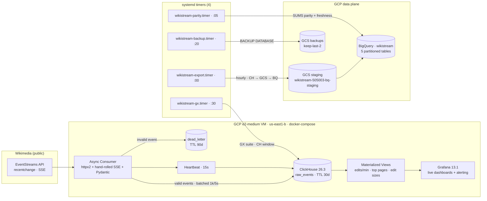

**The delivery lifecycle** — every phase gated by a Go/No-Go checkpoint, evidence captured once, everything rebuildable from scratch:

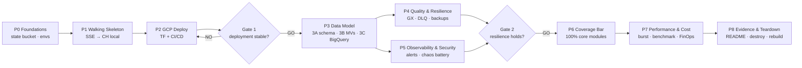

**Why this shape?** Every choice traces to an explicit trade-off analysis (ADR-001…011, full table in [Design Decisions](#design-decisions-adrs)) — ClickHouse over Postgres/BigQuery-as-engine (OLAP-native, no per-second billing on a continuous dashboard), native SSE over Kafka (the source is a single ordered feed; proven on a sibling project), a single VM over GKE (right-sized for ~40K events/min), and systemd timers over Cloud Scheduler (the database the jobs query lives on the same host).

---

## Engineering Highlights

| Area | Decision | Why |
| --- | --- | --- |
| **Streaming ingestion** | Async `httpx2` + hand-rolled WHATWG-compliant SSE parser | Zero-dependency, full control over `Last-Event-ID` resume semantics; the production `httpx` fork was abandoned upstream |
| **Schema-on-write** | Pydantic v2 validation *before* persistence | Every row in ClickHouse is guaranteed typed before it hits disk; malformed events route to a dead-letter table, never to the store |
| **Batching** | 1,000 rows / 5s flush with `async_insert=1, wait_for_async_insert=0` | ~40x fewer round-trips; ClickHouse merges tiny inserts server-side |
| **Query layer** | 3 SummingMergeTree materialized views, **no `POPULATE`** | Dashboard queries skip JSON parsing entirely: **15.0x faster p50**, **~200x fewer rows scanned** |
| **Warehouse tier** | Hourly CH → GCS → BigQuery export + parity check | Queryable partitioned history past the 30-day raw TTL; **SUMS-based parity** (not row counts — merge-state-safe) |
| **Data quality** | Pydantic inline + Great Expectations batch suite on a systemd timer | Two layers: sub-second validation at the edge, distributional checks (nulls, freshness, cardinality, bot-ratio) on a rolling window |
| **Automation** | 4 systemd timers + 8 unit files provisioned by `boot.sh` | Backup, GX, export, parity all run unattended; `Persistent=true` catches missed runs after reboot |
| **Resilience** | Durable JSON-array SSE cursor, atomic `os.replace`, 10s graceful shutdown | Kill the container with SIGKILL mid-insert and resume **zero-loss, zero-dup** — proven empirically |
| **Alerting** | 5 Grafana rules → Slack + 2 Cloud Monitoring policies → email | Two non-overlapping layers: app/pipeline vs infrastructure; every rule fired, verified, and cleared in chaos testing |
| **Cost control** | Time-boxed build-run-teardown lifecycle | **$41.65/mo** full run-rate, **$1.79/mo** residual after teardown — inside a $300 trial for 7+ months |

---

## Key Metrics at a Glance

| Metric | Value |
| --- | --- |
| Raw events ingested (live count) | **58,938,615** and growing |
| Sustained ingestion rate | **~203.5 events/sec** (12,210/min average over 3 days) |
| Observed burst windows | **14K–36K events/min** sustained |
| 24h average throughput (real dataset) | **565.5 events/sec** |
| Real-world peak minute | **2,719 events/sec** (2026-08-13 15:16) |
| Burst-test ceiling | **5,655 events/sec × 60s = 2.08x real peak, 0 drops** (576,740 events total) |
| Dashboard query speedup (MV vs raw scan) | **15.0x p50 / 13.2x p99** (Q1), **3.8x / 3.5x** (Q2) |
| Rows scanned per query (MV vs raw) | **0.23M vs 46.8M — ~200x fewer** |
| Test suite | **143 passed**, 2 skipped, **99.38% coverage** |
| Business-critical modules (6) | **262/262 statements — 100.00%** |
| Great Expectations gate | **11/11 expectations, exit 0**, hourly on a 5% sample |
| Data-loss events | **0** — across burst tests, SIGKILL resume, 8 chaos injections |
| Dead-letter routing | Only validation failures (never transport failures) — TTL 90 days |
| Restore verification | **4,514,837 / 4,514,837 rows exact** from a GCS backup |
| Warehouse freshness | **< 60 min** to BigQuery, parity-verified hourly |
| Infrastructure cost | **$41.65/month** run-rate · **$1.79/month** residual post-teardown |

---

## Proof — Live System Evidence

Every number on this page is backed by a real artifact — screenshots and terminal output captured from the live system. These are the receipts.

**The core store — 58.9M+ rows and the ingestion rate:**

<p align="center">
  
  <em>Live ClickHouse: 58,938,615 raw events, 3-day span, 12,210 events/min average ≈ 203.5 ev/s.</em>
</p>

<p align="center">
  
  <em>Per-minute throughput over the last 30 minutes — 14K–36K events/min bursts, ingested continuously.</em>
</p>

**The quality gates — tests and data-quality suite:**

<p align="center">
  
  <em>Full suite: 143 passed, 2 skipped in 66s; 99% coverage across the consumer core.</em>
</p>

<p align="center">
  
  <em>Great Expectations against a live ClickHouse window: 11/11 expectations pass, exit code 0.</em>
</p>

**The ops automation — everything unattended:**

<p align="center">
  
  <em>Four production timers, all active: backup (:20), GX suite (:30), warehouse export (:00), parity check (:05).</em>
</p>

**The live dashboard:**

<p align="center">
  
  <em>WikiStream Live Analytics — edit velocity, bot-vs-human split, top pages, per-project volume, edit-size histogram.</em>
</p>

---

## Demos

### Live Dashboard

> The Grafana dashboard queries **materialized views only** — pre-aggregated per minute, so the 10s-refresh panels stay sub-10ms even while the raw table holds tens of millions of rows. Panels: edit velocity (30 rows over 15 min), bot-vs-human pie, top pages bar gauge (10), project-language bars (15), edit-size histogram (6 buckets).

### Data Quality Gate

> The GX suite runs hourly at :30 on a rolling 1-hour window, sampling 5% of ~1.2M rows. A single failed expectation (e.g. freshness lag, nulls, schema drift) exits non-zero and fires the `gx-fail` alert. Shown above: a clean **11/11 pass**; during chaos testing a forced failure produced `expectations_failed: 1` with the exact error payload and a **1.0 → 0.0 pipeline-health verdict**.

### CI/CD Pipeline

> Every pull request gets an automatic Terraform plan comment; every merge to `main` builds the container image, pushes it to Artifact Registry, and — gated by the `production` GitHub Environment with a required reviewer — applies infrastructure and reboots the VM with the new startup script.

---

## Component Deep Dives

### 1. Ingestion & SSE Client

The consumer is a single async loop with three independent concerns, all testable in isolation.

**SSE parsing** (`src/sse.py`, ~30 lines, stdlib-only):

| Behavior | Detail |
| --- | --- |
| Protocol | WHATWG Server-Sent Events, strict UTF-8, trailing-`\r` hold for split frames |
| Resume | Sends `Last-Event-ID`; the Wikimedia server accepts the **JSON-array** id and replays from the first event strictly after it |
| Backoff | `SSE retry:` / HTTP `Retry-After` → `min(max(retry_ms/1000 if set else 1.0, retry_after), 30.0)` — capped at 30s, never thundering |
| Reconnect log contract | `connected url=… / reconnect reason=… / insert_failed=… / inserted events=<n> total=<cum>` — greppable, alertable |

**Transport** — `httpx2` (the maintained continuation of the stalled `httpx` project; Pydantic stewarded), pinned `==2.10.0`. Streaming response with a per-chunk parse boundary.

**Model validation** (`src/models.py`) — the real shape of the feed surprised us: Wikimedia sends `timestamp` as **integer epoch seconds** (`{"timestamp": 1786626323}`), not ISO-8601, and the SSE `id:` is a **JSON array** of topic/partition cursors, not a plain number. `validate_timestamp` accepts `int | float`, coerces epoch → UTC datetime, tolerates naive input and a 5-minute clock skew. A 21-test matrix pins the pydantic coercion behavior (lax-mode bools coerce everything; `str` does *not* coerce ints).

### 2. ClickHouse Schema & Migrations

**Migration runner** — plain `bash` + ClickHouse HTTP API (no client binary in the container), `set -euo pipefail`, a 30×2s readiness wait, and a `default.schema_migrations` bookkeeping table. Idempotent by design: re-running on a clean database applies exactly once (`SKIP 000 / APPLY 001 / SKIP 002 / SKIP 003`); re-running against an applied schema skips everything.

**`001_raw_events`** — the full typed schema:

```sql
CREATE TABLE default.raw_events (
    inserted_at   DateTime64(3, 'UTC'),
    event         String,
    event_type    String MATERIALIZED JSONExtractString(event, 'type'),
    wiki          String MATERIALIZED JSONExtractString(event, 'wiki'),
    title         String MATERIALIZED JSONExtractString(event, 'title'),
    user          String MATERIALIZED JSONExtractString(event, 'user'),
    is_bot        UInt8  MATERIALIZED JSONExtractBool(event, 'bot'),
    length_new    UInt32 MATERIALIZED JSONExtractUInt(event, 'length', 'new'),
    length_old    UInt32 MATERIALIZED JSONExtractUInt(event, 'length', 'old'),
    event_timestamp DateTime64(3, 'UTC')
                  MATERIALIZED parseDateTime64BestEffort(JSONExtractString(event, 'timestamp'))
)
ENGINE = MergeTree
PARTITION BY toYYYYMMDD(inserted_at)
ORDER BY (inserted_at, sipHash64(event))
TTL inserted_at + INTERVAL 30 DAY
SETTINGS max_suspicious_broken_parts = 1000
```

| Setting | Value | Rationale |
| --- | --- | --- |
| Partitioning | Daily on `inserted_at` | Cheap partition-level drops at TTL, time-travel windowed queries |
| Sort key | `(inserted_at, sipHash64(event))` | The hash gives the dedup key a 64-bit collision-safe spread |
| TTL | 30 days (ADR-006) | Live dashboard only needs recent data; warehouse covers history |
| `max_suspicious_broken_parts` | 1000 | Survives unclean shutdowns without refusing to merge (learned the hard way) |

Sample of real persisted rows:

<p align="center">
  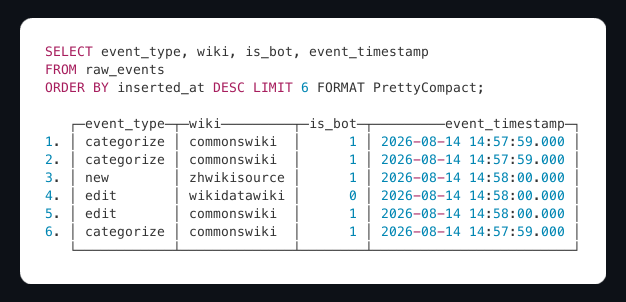
  <em>Actual rows from the live table — categorize/edit/new events across commons, zh, wikidata projects.</em>
</p>

### 3. Materialized Views

Three views, all `ENGINE = SummingMergeTree`, all created **without `POPULATE`** (history starts at deploy; refreshes continuously at ingestion rate):

| View | Grain | Measures | Purpose |
| --- | --- | --- | --- |
| `004_mv_edits_per_minute` | `(minute, wiki, is_bot)` | `count() AS edits`, `sum(length_new - length_old) AS bytes_delta` | Edit velocity + bytes churn |
| `005_mv_top_pages_per_minute` | `(minute, title, wiki)` | `count() AS edits` | Composite key so identical titles on different wikis never collapse |
| `006_mv_edit_sizes_per_minute` | `(minute, bucket)` | `count() AS edits` | 6 size buckets via `multiIf`: `0 / 1-10 / 11-100 / 101-1000 / 1001-10000 / 10000+` |

**Exactness is verified, not assumed** — the MV equivalence suite asserts `MV == raw` on live data:

```
sum(edits)      MV 5821     == raw 5821
sum(bytes_delta) MV 4693117 == raw 4693117     (exact, TSVWithNames)
```

MV row counts are deliberately **never** compared to raw counts — `SummingMergeTree` row counts are merge-state-dependent, which is also why the warehouse parity layer compares SUMS (see §5).

### 4. Grafana Dashboards

`wikistream-live` ("WikiStream Live Analytics"), provisioned as code, 10s refresh:

| Panel | Query source | Verified output |
| --- | --- | --- |
| Edit velocity | `004_mv_edits_per_minute` | 30 rows (15 min × bot/human) |
| Bot vs human | `004` ratio | 2 series |
| Top pages | `005_mv_top_pages_per_minute` | 10 rows |
| Project language | `004` grouped by wiki | 15 rows |
| Edit-size histogram | `006_mv_edit_sizes_per_minute` | 6 buckets (1h sum up to 6,008) |

Plugins pinned via `GF_PLUGINS_PREINSTALL`: `grafana-clickhouse-datasource@4.20.0` and `grafana-bigquery-datasource@3.2.0` (the `GF_INSTALL_PLUGINS` path is broken in Grafana 13.1.1 — 404 crash-loop — another hard-won pin).

### 5. BigQuery Warehouse

The warehouse tier answers "what happened last month?" without keeping raw data forever.

| Piece | Design |
| --- | --- |
| Dataset | `wikistream` (US), 5 tables: `kpi_edits_hourly`, `kpi_top_pages_hourly`, `kpi_edit_sizes_hourly`, `raw_events_sample`, `export_runs` |
| Partitioning | `time_partitioning { DAY }` on every KPI table; `kpi_edits_hourly` additionally clustered on `wiki` |
| Export | systemd timer **:00** — `formatDateTime` RFC3339, `if(is_bot,'true','false')` bool cast, deterministic 10% sample via `sipHash64(event) % 100 < 10` |
| Load | `gcloud storage cp` → staging bucket (7-day Delete lifecycle) → `bq load` `NEWLINE_DELIMITED_JSON` |
| Parity | systemd timer **:05** — compares **SUMS** (edits, bytes) between CH window and BQ tables, writes a 1.0/0.0 verdict into `pipeline_health`; failed parity fires `parity-drift` |
| Freshness | Grafana panel 6: `TIMESTAMP_DIFF(CURRENT_TIMESTAMP(), MAX(exported_at), MINUTE)` — green < 60, orange 60–120, red > 120 |

**Proven end-to-end:** export run at 18:00:19 → 18:03:33 delivered `rows_edits=272, rows_top_pages=40,870, rows_sizes=6, rows_raw_sample=10,516`; the parity check confirmed `edits=48,833 / bytes_delta=43,943,656` match ClickHouse exactly; freshness panel read 14 minutes. When parity *did* fire during chaos testing (a windowed DELETE of the BQ tables), the remediation — re-run `export.sh`, which reloads the identical window — restored `verdict 1.0` and the alert cleared.

<p align="center">
  
  <em>The BigQuery dataset in the GCP console — 5 partitioned tables, hourly loads, verified parity.</em>
</p>

### 6. systemd Automation

The batch plane is eight unit files, all installed by `boot.sh`:

| Timer | Schedule | `Persistent=true` | Job |
| --- | --- | --- | --- |
| `wikistream-backup.timer` | :20 hourly | yes | Native `BACKUP DATABASE` → GCS, keep-last-2 |
| `wikistream-gx.timer` | :30 hourly | yes | Great Expectations suite on the latest hour |
| `wikistream-export.timer` | :00 hourly | yes | CH → GCS → BigQuery export |
| `wikistream-parity.timer` | :05 hourly | yes | SUMS parity + freshness verdict |

Plus a **15-second consumer heartbeat** that writes deltas (`inserted_delta`, `dead_lettered_delta`, `insert_failed_delta`, `duplicates_skipped_delta`) into `pipeline_health` — the single source every alert queries.

### 7. Data Quality — Pydantic + Great Expectations

Two layers, deliberately split (ADR-005):

1. **Inline (sub-second):** Pydantic v2 validation at the edge — type, timestamp parseability, schema shape. Failures route to `dead_letter`, never to the store.
2. **Batch (hourly):** Great Expectations `0.18.22` against a rolling window, sampling **5%** of ~1.2M rows/hour.

The GX suite checks (all tuned to *measured* production bounds, not guessed ones):

| Expectation | Production bound | Why |
| --- | --- | --- |
| Row count in range | `(50,000, 5,000,000)` | Full-window pre-check; VM volume is 1.2M rows/hr, not the planned 160K |
| Nulls = 0 | wiki, title, event_type, is_bot, length_new, event_timestamp | Schema-on-write should make nulls impossible |
| `event_type` domain | `{edit, new, log, categorize}` | Drift detection |
| Median lag | `< 300s` between `event_timestamp` and `inserted_at` | Freshness — the pipeline must keep up |
| Max skew | `< 300s` | Clock anomalies |
| Wiki cardinality | `> 100` distinct | Live feed sanity |
| Bot ratio | `∈ (0.05, 0.95)` | Measured mean is 0.493 |

Sampling uses `rand() < int(0x100000000 * rate)` — `%`-based sampling breaks through GX's SQLAlchemy wrapper. A failed suite **exits 1** (the alert hook) and writes a 0.0 verdict to `pipeline_health`.

### 8. Resilience — Dead Letter, Resume, Dedup

**Dead-letter table** (`dead_letter`, TTL 90 days):

- Written **only** from the validation branch — invalid JSON, unparseable timestamps, pydantic errors. Transport failures never land here (keeps the DLQ-rate alert semantically honest).
- Synchronous insert (`async_insert=0`) + **at-least-once**: a failed DL insert re-runs after reconnect.
- Proved: `dead_letter GROUP BY reason → 4× timestamp_missing, 1× validation:invalid_json, 4× timestamp_unparseable`, with `dead_lettered=4, insert_failed=0`.

**Durable resume** — the cursor lives on the ch-data disk (`/mnt/ch-data/state/consumer_state.json`), written atomically via `tmp + os.replace`. The durable id **advances only on a successful flush or DL insert** — never on receipt. Graceful shutdown joins within 10s.

> **The SIGKILL proof:** `sudo docker kill` the consumer mid-stream (exit 137). On restart it emitted `resumed_from=[…]`, replayed the kill-window redeliveries into the dedup ring, and logged `inserted events=1000 total=4370 duplicates_skipped=85→150` — **zero loss, zero duplicates**.

**Batcher + dedup ring:** `EventBatcher(max_rows=1000, max_age_s=5.0, dedup_capacity=50_000)` — flush at ≥1,000 rows or ≥5s, single `async_insert=1, wait_for_async_insert=0` insert. A `deque(maxlen=50_000)` + set mirror (~20 min at 44 ev/s) absorbs the server's own replays: live runs show `duplicates_skipped=3/7/10` catching native redeliveries. On flush exception, rows are dropped **at-most-once and counted** — never silently.

### 9. Backup & Restore

| Piece | Detail |
| --- | --- |
| Backup | `BACKUP DATABASE default TO Disk('backups', '<name>')` — native ClickHouse, `case *BACKUP_CREATED*` completion guard |
| Upload | `gsutil -q -o GSUtil:parallel_composite_upload_threshold=0 cp -r` → `gs://wikistream-505003-backups/` (composite uploads need an object-delete permission the SA intentionally lacks) |
| Pruning | keep-last-2 locally + GCS bucket lifecycle (Delete, age 2 days) |
| Cost | ~3.4s CPU per backup |
| Restore | **Verified once, exactly:** restored `backup-20260813-165326` from GCS → `restore_check.raw_events` `count() WHERE inserted_at <= 16:53:28.084` = **4,514,837 == 4,514,837 exact** |

<p align="center">
  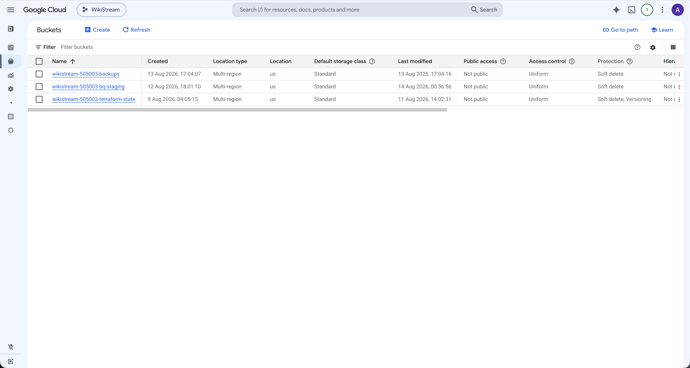
  <em>GCS in the console — the backups bucket (keep-last-2, age-2-day lifecycle) and the BigQuery staging bucket (7-day lifecycle).</em>
</p>

### 10. Observability & Alerting

Two **non-overlapping** layers (ADR-010) — app/pipeline vs infrastructure:

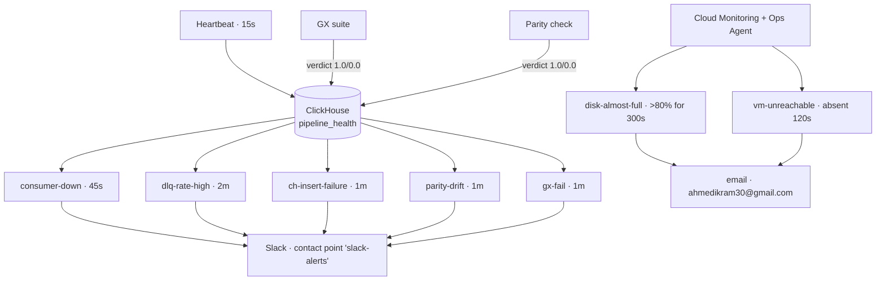

| Rule | Trigger | Proven in chaos run |
| --- | --- | --- |
| `consumer-down` | Heartbeats absent (45s) | Fired 01:01:37, inactive 01:04:41 after resume |
| `dlq-rate-high` | Dead-letter delta ratio → 1.0 (2m) | Fired 01:14:30 on 8,211 injected malformed rows, Slack delivered, cleared ~01:24 |
| `ch-insert-failure` | `insert_failed_delta > 0` (1m) | Fired 01:24:00 with ClickHouse down 90s (182K failed inserts absorbed, no crash) |
| `parity-drift` | BQ vs CH SUM mismatch (1m) | Fired 01:40:34 after a windowed BQ DELETE; cleared 01:48:16 after re-export |
| `gx-fail` | GX exit ≠ 0 (1m) | Forced failure produced the exact error payload and a 0.0 verdict |

Every rule fired, **Slack and email delivery confirmed by the recipient**, then each was verified cleared. The chaos battery ran **8/8 injections** (consumer kill, DLQ flood, ClickHouse outage, parity drift, GX forced-fail, 17GB disk fill to 86%, VM stop/unreachable, firewall lockdown) — each fired its alert, was remediated, and cleared.

<p align="center">
  
  <em>Slack alert delivery — the alert fired, then cleared, end-to-end on the live system.</em>
</p>

<p align="center">
  
  <em>Cloud Monitoring email alerts for disk-almost-full and vm-unreachable.</em>
</p>

### 11. Performance — Burst & Benchmark

**Burst harness** (`scripts/burst_test.py`) — stdlib-only asyncio (deliberately not k6), the *real* consumer binary as a subprocess, fresh state per level, zero consumer code changes, 1% malformed traffic by design. Against a baseline measured from the real 50.2M-row dataset:

| Level | Target | Sent | Valid | Dead-lettered | Drops |
| --- | --- | --- | --- | --- | --- |
| baseline | 565.5 ev/s | — | — | — | — |
| smoke | 200/s | 998 | 992 | 6 | **0** |
| 2× | 1,131/s | 67,849 | 67,196 | 653 | **0** |
| 5× | 2,828/s | 169,639 | 167,889 | 1,750 | **0** |
| 10× | 5,655/s | 339,252 | 335,870 | 3,382 | **0** |

**576,740 events through the real pipeline, zero drops at every multiple.** The 10× level sustained **5,655 ev/s for 60s — 2.08× the real observed peak minute (2,719 ev/s)** — and no ceiling appeared below 10× baseline. Dead-letter routing matched injection exactly per reason at every level; the durable cursor matched the flushed valid count exactly.

**Query benchmark** — real 50.2M-row dataset, client-side `time.perf_counter`, 1 warmup + 5 timed runs, 24h window, canonical dashboard queries:

| Query | Raw p50 | MV p50 | Speedup | Rows scanned |
| --- | --- | --- | --- | --- |
| Q1 edit velocity | 92,837 ms | 6,198 ms | **15.0x** (p99 13.2x) | **46.8M → 0.23M (~200x fewer)** |
| Q2 top pages | 218,791 ms | 58,026 ms | **3.8x** (p99 3.5x) | 18.0M → 15.1M |

Q2's smaller scan reduction is expected — the win there is pre-aggregated narrower rows (no `JSONExtract`, no minute re-grouping).

### 12. Cost / FinOps

Itemized from the real `gcloud` inventory at us-east1 rates — no estimates:

| Item | Monthly |
| --- | --- |
| e2-medium VM (1 × 2 vCPU / 4GB, `$0.0359/h`) | $26.21 |
| Boot disk 50GB pd-standard | $5.00 |
| ch-data disk 50GB pd-standard | $5.00 |
| Static external IP | $3.65 |
| GCS (backups 46.4GB age-2d + staging 8.8GB age-7d) | ~$1.11 |
| 3 × Secret Manager secrets | $0.18 |
| BigQuery (5 tables, <0.1GB) | < $0.50 |
| Artifact Registry + Cloud Monitoring | ~$0 |
| **Total run-rate** | **≈ $41.65/mo** |

- **$300 trial ≈ 7.2 months** of full run-rate.
- VM + disks + IP = **$39.86 = 93%** of the bill — everything on the teardown list (ADR-001).
- **Residual post-teardown ≈ $1.79/mo** (buckets, secrets, BQ dataset).

---

## Design Decisions (ADRs)

Every architectural call is traceable to a numbered ADR (`docs/planning/vision-and-adr.md`):

| ADR | Decision | Alternative | Why this |
| --- | --- | --- | --- |
| 001 | Build-run-teardown lifecycle | Permanent deployment | Time-boxed demo; **rebuildable from scratch** is a feature, not a risk |
| 002 | Single e2-medium VM + 3 docker services | GKE / multi-node | Right-sized for ~40K events/min; one surface to secure |
| 003 | Self-hosted ClickHouse engine | Postgres, TimescaleDB, Druid, Pinot, Snowflake, ClickHouse Cloud | OLAP-native, no per-second billing on a continuous dashboard, no free cloud tier; BigQuery added as warehouse (Phase 3C), not engine |
| 004 | Async httpx2 + hand-rolled SSE | Kafka, plain httpx | One ordered source feed; zero broker ops; full control of `Last-Event-ID` resume |
| 005 | Pydantic inline + GX batch split | GX-only | Sub-second edge validation + distributional batch checks; DLQ in ClickHouse not a file |
| 006 | Partitioned MergeTree + MVs + 30-day TTL + native backups | Raw-only, no TTL | Dashboard speed, bounded storage, restorable history |
| 007 | Terraform with GCS state via bootstrap | Local/remote state elsewhere | State bucket never destroyed by teardown |
| 008 | GitHub Actions + WIF, gated apply | Static keys, auto-apply | Zero long-lived credentials; `production` Environment requires a reviewer |
| 009 | pytest + coverage gates (100% core, ≥90% overall) | No gates | CI **rejects** PRs below the bar — proven by deliberately breaking a line |
| 010 | Grafana (app) + Cloud Monitoring (infra) alerting | Prometheus | Two non-overlapping layers; dashboards-as-code; firewall-locked |
| 011 | No ML scope | Add ML | LAAD owns the ML story on the CV; boundary keeps this project focused |

**Cut during design:** Snowflake cold path, Cloud Scheduler + Cloud Run Jobs (the DB is on the same VM the timers run on), k6 harness (stdlib asyncio was sufficient), Prometheus (Grafana native alerting proven on W3C).

---

## Testing

| Layer | Result |
| --- | --- |
| Full suite (`pytest --cov=src`, all 143 incl. 31 ClickHouse integration) | **143 passed, 2 skipped** in 66s |
| Coverage — consumer core | **99.38% (484 stmts, 3 miss)** |
| Coverage — 6 business-critical modules | **262/262 = 100.00%** (`sse`, `models`, `batcher`, `dead_letter`, `heartbeat`, `healthcheck`) |
| Coverage — `gx/suite.py` | **89/89 = 100%** (parallel-mode `coverage combine`) |
| Integration (`-m ch`, real ClickHouse) | 31 tests: migrations, MV equivalence, kill/resume, DLQ, healthchecks |
| GX suite tests | 17 green — drive the real `suite.py` as a subprocess and assert the exit-code contract |
| CI gate | Per-module `--cov-fail-under=100` + overall `--cov-fail-under=90` — **blocks merges** |

The 2 skips are `pytest.importorskip("great_expectations")` — GX pins Python 3.12 (no cp313 wheels) while the consumer runs 3.13/3.14; those tests run green under the GX project's own env. The gate itself was proven: deleting one covered line from `sse.py` made CI exit 1 with 31 failures; restoring it → exit 0, 112 passed, 262/262.

---

## Infrastructure (Terraform)

| Module | Resources | Notes |
| --- | --- | --- |
| `network` | VPC, subnet `10.0.0.0/24`, **4 firewall rules** | Ports 22/3000/8123 restricted to one IP (`allow_internal` for the /24); a `null_resource` deletes GCP's default allow-all rules |
| `compute` | Static IP, e2-medium, 50GB boot, ubuntu-2404 + OSLogin, startup script | `startup.sh` is idempotent: installs agent/CLI, renders `.env`, runs migrations, `compose pull && up` |
| `iam` | VM SA (secretAccessor ×2, monitoring writer), deploy SA (6 roles) | Least-privilege; a 22-row IAM review matrix documents every binding (`docs/planning/iam-review.md`) |
| `bigquery` | Dataset + 5 tables, staging bucket | Dataset-scoped `dataEditor` only (ADR-010) |
| `storage` | Artifact Registry reader | Scoped to the single image repo |
| `monitoring` | Ops Agent policies: disk-almost-full, vm-unreachable | Email channel; agentless uptime check |
| `backups` | Backups bucket + IAM | Legacy-bucket-reader role; 2-day lifecycle |

State lives in `gs://wikistream-505003-terraform-state` (bootstrap config, local state, **never destroyed**). Terraform ~1.15 / Google provider 7.41.

<p align="center">
  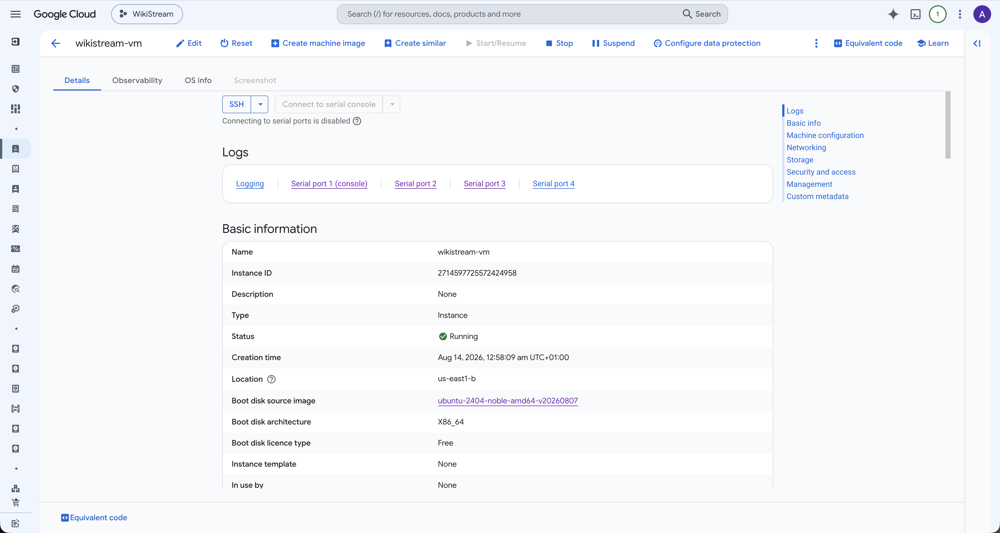
  <em>The production VM — e2-medium, static IP, both disks, OS Login.</em>
</p>

<p align="center">
  
  <em>The VPC network — custom subnet and the four lockdown firewall rules.</em>
</p>

---

## CI/CD Pipeline

Two workflows, both using Workload Identity Federation (no stored GCP keys):

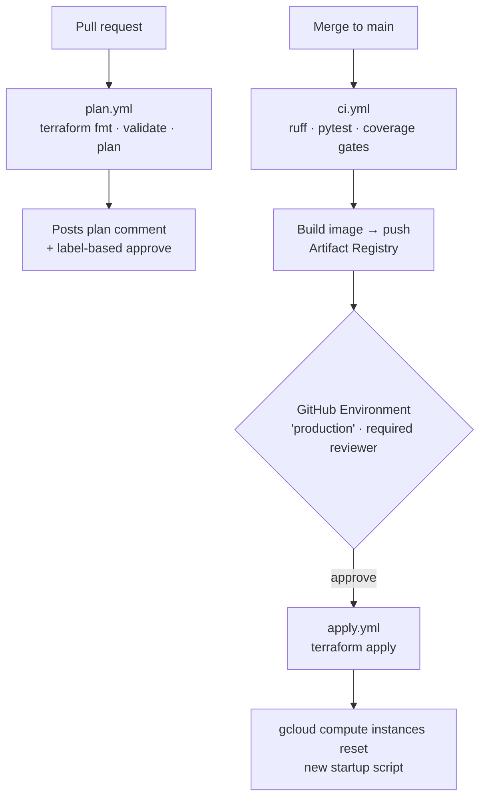

| Workflow | Trigger | Guard |
| --- | --- | --- |
| `plan.yml` | Any PR | Auto-comment with the plan diff |
| `ci.yml` | Push to main | Lint + tests + **coverage gates block** |
| `apply.yml` | Push to main, after CI | `production` Environment, required reviewer, concurrency per-ref |

The apply path does double duty as the deploy mechanism: `startup.sh` edits force a VM recreate (`metadata_startup_script` is `ForceNew` in the provider), and a boot-time `git fetch origin && git reset --hard origin/HEAD` guarantees the VM runs exactly the merged tree.

<p align="center">
  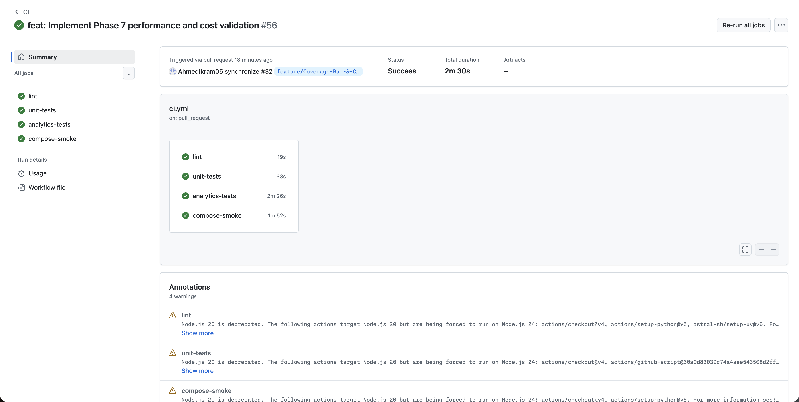
  <em>CI — lint, tests, coverage gates, image build.</em>
</p>

<p align="center">
  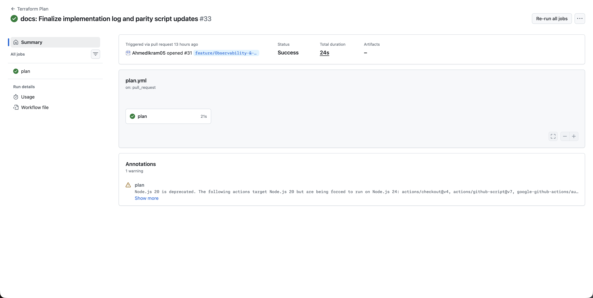
  <em>plan.yml — automatic plan comment on every PR.</em>
</p>

<p align="center">
  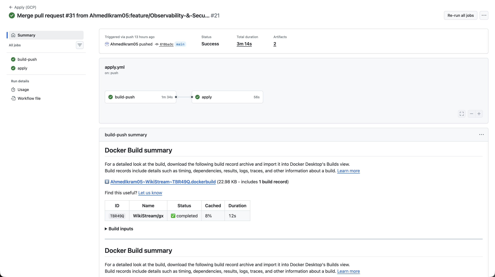
  <em>apply.yml — gated apply, then VM reset.</em>
</p>

---

## Security Model

| Layer | Mechanism |
| --- | --- |
| Credentials | **Zero static keys.** WIF for CI; Secret Manager for `clickhouse-password`, `grafana-admin-password`, `slack-webhook-url` (random 81-byte value) |
| Network | Firewall allows only ports 22/3000/8123 **from a single IP**; internal /24; GCP default allow-all rules deleted by Terraform. Cloud Shell is refused, home IP passes |
| VM access | OS Login (`user:jess154lacroix@gmail.com`), no password SSH |
| IAM | Dataset-scoped BQ `dataEditor`, repo-scoped AR reader, minimal SA roles — 22-row review matrix with recorded deviations (D1–D6) |
| Data | Raw TTL 30d, dead-letter 90d, `pipeline_health` 7d; backups age 2d |
| Secrets in state | `secrets.tf` generates `random_password` → Secret Manager only; rotation noted as a Phase-5 follow-up |

<p align="center">
  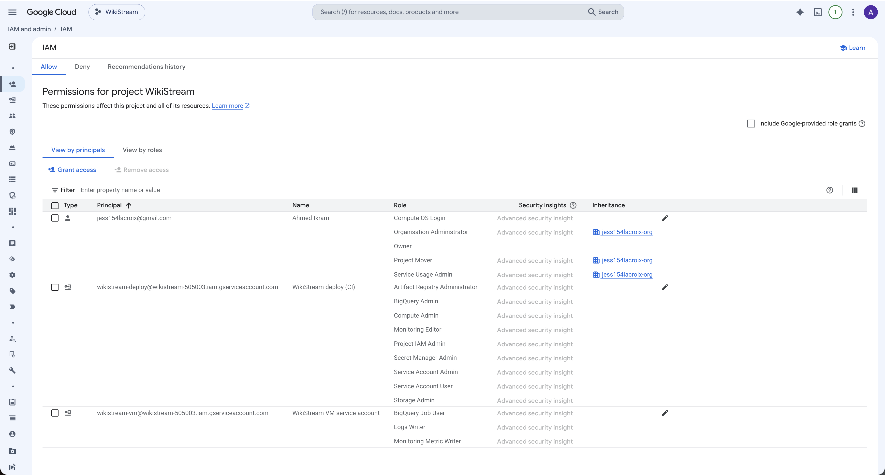
  <em>IAM — the before/after review matrix documenting every role binding.</em>
</p>

---

## Getting Started

### Prerequisites

- Docker + Docker Compose
- Python 3.13+ (consumer) / 3.12 (GX — pinned by Great Expectations' wheel availability)
- `uv` (used for all tooling)
- For GCP: Terraform ~1.15, `gcloud` authenticated to a project with billing

### Quick Start

```bash
# 1. Start ClickHouse locally
docker compose up -d clickhouse

# 2. Run the migration suite against it
#    (see migrations/README — the runner is bash + HTTP API)

# 3. Run the consumer (streams real Wikipedia edits)
uv run --project consumer python -m src.consumer
```

### Configuration

Environment variables (secrets come from Secret Manager on the VM; `.env` locally):

| Variable | Purpose | Default |
| --- | --- | --- |
| `CLICKHOUSE_HOST` / `PORT` | CH endpoint | `localhost:8123` |
| `CLICKHOUSE_USER` / `PASSWORD` | CH credentials | `wikistream` |
| `SSE_URL` | Wikimedia stream | `https://stream.wikimedia.org/v2/stream/recentchange` |
| `BATCH_MAX_ROWS` / `BATCH_MAX_AGE_S` | Flush policy | `1000` / `5.0` |
| `DEDUP_CAPACITY` | Dedup ring size | `50000` |
| `HEALTH_STALE_SECONDS` | Consumer health staleness | `300` |
| `GX_WINDOW_HOURS` / `GX_SAMPLE_RATE` / `GX_ROW_MIN` / `GX_ROW_MAX` | GX window & bounds | `1` / `0.05` / `50000` / `5000000` |

### Running Tests

```bash
# Full suite (unit + ClickHouse integration — requires local CH)
uv run --project consumer pytest --cov=src

# GX suite (requires CH with data in the configured table)
uv run --project gx pytest tests/gx
```

### Production Deployment

```bash
# Everything is Terraform + GitHub Actions
terraform -chdir=infra/main plan   # preview
# merge to main → CI → gated apply → VM reset
# teardown (Phase 8): terraform destroy, bootstrap state bucket excluded
```

---

## Project Structure

```
wikistream/
├── consumer/                 # Async SSE consumer + ClickHouse client
│   └── src/
│       ├── consumer.py       # Main loop: connect, parse, validate, batch, insert
│       ├── sse.py            # WHATWG SSE parser (stdlib only)
│       ├── models.py         # Pydantic event models + timestamp coercion
│       ├── batcher.py        # 1k-row / 5s batching + dedup ring
│       ├── dead_letter.py    # At-least-once DLQ writer
│       ├── heartbeat.py      # 15s pipeline_health writer
│       └── healthcheck.py    # Docker healthcheck entrypoint
├── gx/                       # Great Expectations 0.18.22 suite (Python 3.12)
│   └── suite.py              # 8 expectations on a rolling window, exit-code contract
├── migrations/               # Versioned .sql migrations (000–008) + bash runner
├── warehouse/                # Export/parity scripts + SQL + systemd units
├── infra/
│   ├── bootstrap/            # State bucket + WIF (local state, never destroyed)
│   └── main/                 # network/compute/iam/bigquery/storage/monitoring/backups
├── scripts/                  # burst_test.py, etc.
├── tests/                    # pytest suites (unit + -m ch integration)
├── docs/                     # implementation log, master plan, vision + ADRs
├── assets/                   # Screenshots & terminal evidence
├── docker-compose.yml
└── .github/workflows/        # ci.yml, plan.yml, apply.yml
```

---

## Documentation

| Doc | What it covers |
| --- | --- |
| `docs/implementation-log.md` | Day-by-day build log — every phase's ACs, evidence, and incidents (2,100+ lines) |
| `docs/planning/master-plan.md` | Walking-skeleton methodology, phase dependency graph, Go/No-Go gates |
| `docs/planning/vision-and-adr.md` | Product vision, component inventory, 11 ADRs, trade-off analysis |
| `docs/planning/iam-review.md` | 22-row IAM review matrix with recorded deviations |
| `docs/planning/coverage-boundary.md` | Which modules are business-critical and why |

---

## Related Projects

- [**W3C Web Logs ETL Pipeline**](https://github.com/AhmedIkram05/w3c-etl-pipeline) — serverless Databricks DLT medallion pipeline, dbt, Airflow, Power BI — the batch-oriented sibling to this project's streaming story.
- [**LAAD**](https://github.com/AhmedIkram05/laad) — ATM log anomaly detection: Kafka ingestion, 3-layer detection, Agentic RAG, ECS Fargate.
- [**SWE-Qwen**](https://github.com/AhmedIkram05/SWE-Qwen) — SWE-bench → QLoRA fine-tuning → execution-based evaluation LLMOps platform.
- [**StockLens**](https://github.com/AhmedIkram05/stocklens) — receipt-to-trading FinTech app: FastAPI, LangGraph, LSTM, Rust features engine.
- [**DevSync**](https://github.com/AhmedIkram05/DevSync) — team project management with real-time collaboration, ECS Fargate.

---

<p align="center">
  <b>WikiStream</b> — every Wikipedia edit, in real time: SSE → ClickHouse → Grafana → BigQuery.<br/>
  Built with Python · httpx2 · ClickHouse · Grafana · Great Expectations · Terraform · Google Cloud · GitHub Actions.<br/>
  MIT © Ahmed Ikram
</p>
