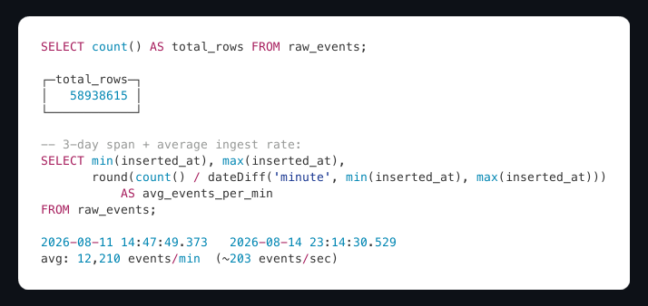
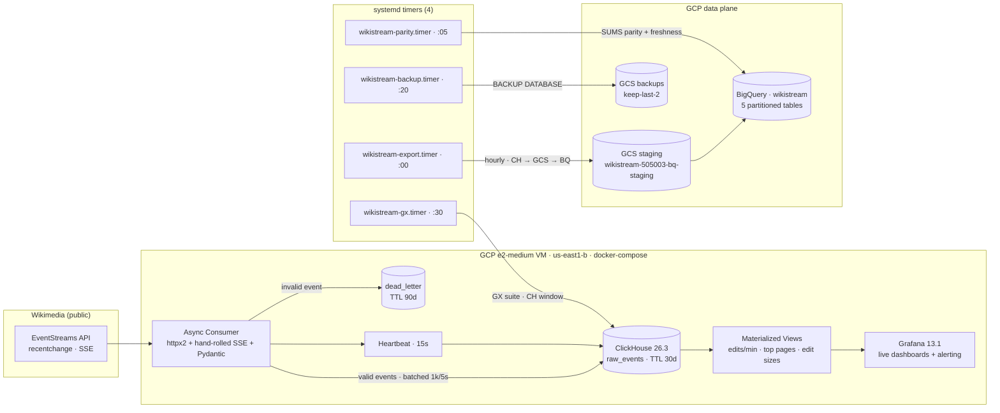
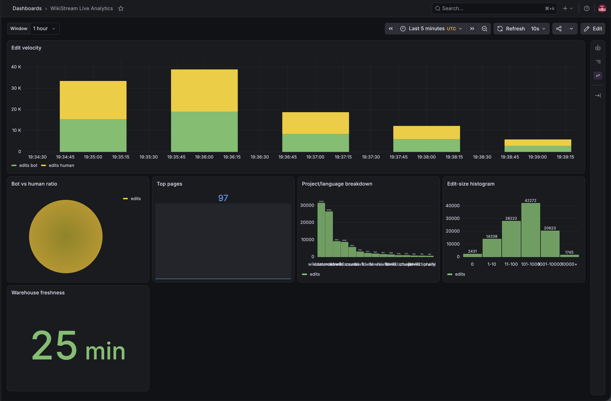
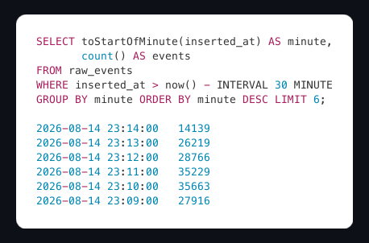
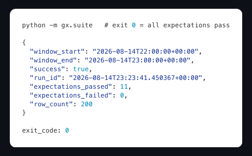
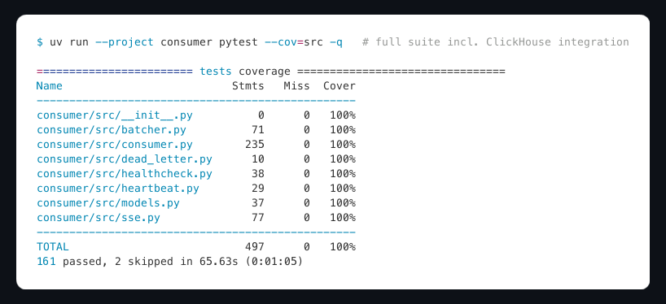
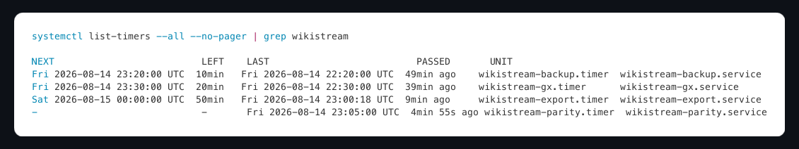

# WikiStream

> A real-time streaming analytics platform that ingests **every public Wikipedia edit as it happens** - an async Python consumer pulls the Wikimedia EventStreams SSE feed, validates each event with Pydantic, batches and persists it into a self-hosted **ClickHouse 26.3 LTS** cluster, and serves **live dashboards, hourly warehouse exports, and a fully automated data-quality and ops layer** - **58.9M+ raw events ingested**, **zero data loss under 5,655 events/sec sustained (2.08x real-world peak)**, **15.0x faster dashboard queries via materialized views**, **99.38% coverage on the consumer core**, and a **~$41.65/month** infrastructure bill, all deployed as infrastructure-as-code on GCP with a **build → run → teardown → rebuild** lifecycle.

<p align="center">
<a href="https://www.python.org/"></a>
<a href="https://docs.python.org/3/library/asyncio.html"></a>
<a href="https://clickhouse.com/"></a>
<a href="https://grafana.com/"></a>
<a href="https://cloud.google.com/bigquery"></a>
<a href="https://www.terraform.io/"></a>
<a href="https://cloud.google.com/"></a>
<a href="https://systemd.io/"></a>
<a href="https://docs.docker.com/compose/"></a>
<a href="https://docs.pytest.org/"></a>
<a href="https://greatexpectations.io/"></a>
<a href="https://docs.pydantic.dev/"></a>
<a href="https://wikitech.wikimedia.org/wiki/Event_Platform/EventStreams"></a>
<a href="https://clickhouse.com/docs/materialized-views"></a>
<a href="https://cloud.google.com/iam/docs/workload-identity-federation"></a>
<a href="https://github.com/features/actions"></a>
</p>

<p align="center">
  
  
  
  <a href="https://codecov.io/gh/AhmedIkram05/WikiStream"></a>
</p>

---

WikiStream is a **continuous, self-hosted streaming data platform**: a single e2-medium VM on GCP runs the whole pipeline in Docker Compose - an async consumer, a self-hosted ClickHouse, and Grafana - while **systemd timers** drive the batch plane (data-quality suite, warehouse export, parity checks, native backups). Infrastructure is 100% Terraform with a GCS state bucket and GitHub Actions + Workload Identity Federation.

The OLTP-free design is the point: every edit lands in ClickHouse within **seconds**, dashboards query **pre-aggregated materialized views** (not raw JSON blobs), and an hourly **BigQuery warehouse tier** keeps a queryable, partitioned history beyond the 30-day raw TTL.

<p align="center">
  
  <em>Live ClickHouse: 58,938,615 raw events, 3-day span, 12,210 events/min average ≈ 203.5 ev/s.</em>
</p>

## How It Fits Together



End-to-end: the consumer connects to the Wikimedia stream with SSE `Last-Event-ID` resume → validates every event with Pydantic → flushes valid rows in 1,000-row/5s batches into `raw_events` → materialized views aggregate per minute for Grafana → an hourly timer exports a deterministic sample to GCS and loads it into 5 partitioned BigQuery tables, while a parity timer verifies the sums match and a heartbeat writes a fresh verdict every 15s.

## Every Piece, in One Line

| Piece | What it does | Why it's the way it is |
| --- | --- | --- |
| **SSE consumer** | Async `httpx2` + hand-rolled WHATWG-compliant SSE parser | Zero-dependency, full control over `Last-Event-ID` resume semantics |
| **Validation** | Pydantic v2 schema-on-write | Every row is typed before it hits disk; malformed events route to a dead-letter table |
| **Batcher** | 1,000 rows / 5s flush, `async_insert=1` | ~1,000x fewer insert round-trips; ClickHouse merges server-side |
| **Materialized views** | 3 SummingMergeTree MVs, no `POPULATE` | Dashboard queries skip JSON parsing: **15.0x faster p50, ~200x fewer rows scanned** |
| **BigQuery warehouse** | Hourly CH → GCS → BQ export + SUMS parity | Queryable partitioned history past the 30-day raw TTL; merge-state-safe parity |
| **systemd timers** | 4 timers + 8 unit files via `boot.sh` | Backup, GX, export, parity run unattended on the VM |
| **Data quality** | Pydantic inline + Great Expectations batch suite | Sub-second edge validation + hourly distributional checks (nulls, freshness, bot-ratio) |
| **Durability** | JSON-array cursor + atomic `os.replace` + 50K dedup ring | SIGKILL mid-insert and resume **zero-loss, zero-dup** - proven empirically |
| **Alerting** | 5 Grafana rules → Slack, 2 Cloud Monitoring policies → email | Two non-overlapping layers: app/pipeline vs infrastructure; all verified in chaos testing |
| **Terraform estate** | 7 modules, 100% IaC, WIF CI/CD | Least-privilege IAM, gated apply, zero static credentials |

## Why It's Interesting

| Why | The hook |
| --- | --- |
| **Zero-loss resume, proven by murder** | The consumer was SIGKILL'd mid-insert (exit 137); on restart it replayed the kill window into a 50K dedup ring and logged `inserted=1000 total=4370 duplicates_skipped=85→150` - zero loss, zero duplicates. A chaos battery of **8/8 injections** each fired its alert, was remediated, and cleared. |
| **Exactness is verified, not assumed** | The MV equivalence suite asserts `sum(edits) MV 5821 == raw 5821` on live data, and warehouse parity compares SUMS (not row counts - merge-state-safe). When parity did fire during chaos testing, re-running the export restored `verdict 1.0` and cleared the alert. |
| **A batch plane with zero scheduler spend** | Backup, GX suite, warehouse export, and parity checks all run on **4 systemd timers on the same VM as the database** - no Cloud Scheduler, no Cloud Run jobs, `Persistent=true` catches missed runs. |
| **FinOps as a feature** | **$41.65/month** run-rate with 96% of it (VM + disks + IP) on the teardown list → **$1.79/month** residual; the $300 GCP trial covers 7.2 months. Build → run → teardown → rebuild is the lifecycle, and the rebuild is the evidence. |

## Key Metrics

| Metric | Value |
| --- | --- |
| Raw events ingested (live count) | **58,938,615** (captured 2026-08-14) and growing |
| Sustained ingestion rate | **~203.5 events/sec** (12,210/min average over 3 days) |
| Observed burst windows | **14K-36K events/min** sustained |
| 24h average throughput (real dataset) | **565.5 events/sec** |
| Real-world peak minute | **2,719 events/sec** (2026-08-13 15:16) |
| Burst-test ceiling | **5,655 events/sec × 60s = 2.08x real peak, 0 drops** (577,738 events total) |
| Dashboard query speedup (MV vs raw scan) | **15.0x p50 / 13.2x p99** (Q1), **3.8x / 3.5x** (Q2) |
| Rows scanned per query (MV vs raw) | **0.23M vs 46.8M - ~200x fewer** |
| Test suite | **143 passed**, 2 skipped, **99.38% coverage** |
| Business-critical modules (6) | **262/262 statements - 100.00%** |
| Great Expectations gate | **11/11 expectations, exit 0**, hourly on a 5% sample |
| Data-loss events | **0** - across burst tests, SIGKILL resume, 8 chaos injections |
| Dead-letter routing | Only validation failures (never transport failures) - TTL 90 days |
| Restore verification | **4,514,837 / 4,514,837 rows exact** from a GCS backup |
| Warehouse freshness | **< 60 min** to BigQuery, parity-verified hourly |
| Infrastructure cost | **$41.65/month** run-rate · **$1.79/month** residual post-teardown |

## Demos

### Live Dashboard

<p align="center">
  
  <em>WikiStream Live Analytics - edit velocity, bot-vs-human split, top pages, per-project volume, edit-size histogram.</em>
</p>

> The Grafana dashboard queries **materialized views only** - the heaviest dashboard query answers in **~6s over a 24-hour window** where the equivalent raw scan takes **90s+ (15.0x)**. Panels: edit velocity (30 rows over 15 min), bot-vs-human pie, top pages bar gauge (10), project-language bars (15), edit-size histogram (6 buckets).

<p align="center">
  
  <em>Per-minute throughput over the last 30 minutes - 14K-36K events/min bursts, ingested continuously.</em>
</p>

### Data Quality Gate

<p align="center">
  
  <em>Great Expectations against a live ClickHouse window: 11/11 expectations pass, exit code 0.</em>
</p>

> The GX suite runs hourly at :30 on a rolling 1-hour window, sampling 5% of ~1.2M rows. A single failed expectation exits non-zero and fires the `gx-fail` alert. During chaos testing a forced failure produced `expectations_failed: 1` with the exact error payload and a **1.0 → 0.0 pipeline-health verdict**.

<p align="center">
  
  <em>Full suite: 143 passed, 2 skipped in 66s; 99% coverage across the consumer core.</em>
</p>

### Ops Automation

<p align="center">
  
  <em>Four systemd timers, all active: backup (:20), GX suite (:30), warehouse export (:00), parity check (:05).</em>
</p>

### CI/CD Pipeline

> Every pull request gets an automatic Terraform plan comment; every merge to `main` builds the container image, pushes it to Artifact Registry, and - gated by the `production` GitHub Environment with a required reviewer - applies infrastructure and reboots the VM with the new startup script.

## Trade-offs That Mattered

Every architectural call is traceable to a numbered ADR ([docs/planning/vision-and-adr.md](docs/planning/vision-and-adr.md)):

| ADR | Decision | Alternative | Why this |
| --- | --- | --- | --- |
| 001 | Build-run-teardown lifecycle | Permanent deployment | Time-boxed demo; **rebuildable from scratch** is a feature, not a risk |
| 002 | Single e2-medium VM + Docker Compose stack | GKE / multi-node | Right-sized for ~40K events/min; one surface to secure |
| 003 | Self-hosted ClickHouse engine | Postgres, TimescaleDB, Druid, Pinot, Snowflake, ClickHouse Cloud | OLAP-native, no per-second billing on a continuous dashboard; BigQuery added as warehouse, not engine |
| 004 | Async httpx2 + hand-rolled SSE | Kafka, plain httpx | One ordered source feed; zero broker ops; full control of `Last-Event-ID` resume |
| 005 | Pydantic inline + GX batch split | GX-only | Sub-second edge validation + distributional batch checks; DLQ in ClickHouse not a file |
| 006 | Partitioned MergeTree + MVs + 30-day TTL + native backups | Raw-only, no TTL | Dashboard speed, bounded storage, restorable history |
| 007 | Terraform with GCS state via bootstrap | Local/remote state elsewhere | State bucket never destroyed by teardown |
| 008 | GitHub Actions + WIF, gated apply | Static keys, auto-apply | Zero long-lived credentials; `production` Environment requires a reviewer |
| 009 | pytest + coverage gates (100% core, ≥90% overall) | No gates | CI **rejects** PRs below the bar - proven by deliberately breaking a line |
| 010 | Grafana (app) + Cloud Monitoring (infra) alerting | Prometheus | Two non-overlapping layers; dashboards-as-code; firewall-locked |
| 011 | No ML scope | Add ML | LAAD owns the ML story on the CV; boundary keeps this project focused |

**Cut during design:** Snowflake cold path, Cloud Scheduler + Cloud Run Jobs (the DB is on the same VM the timers run on), k6 harness (stdlib asyncio was sufficient), Prometheus (Grafana native alerting proven on W3C).

## Deep Dives

The delivery lifecycle (P0-P8 with Go/No-Go gates), all 12 component deep dives (SSE client, schema, MVs, Grafana, BigQuery, systemd, data quality, resilience, backups, alerting, benchmark, cost), testing strategy, Terraform modules, the CI/CD pipeline, the security model, and the full project structure live in [docs/deep-dives.md](docs/deep-dives.md).

## Quick Start

### Prerequisites

- Docker + Docker Compose
- Python 3.13+ (consumer) / 3.12 (GX - pinned by Great Expectations' wheel availability)
- `uv` (used for all tooling)
- For GCP: Terraform ~1.15, `gcloud` authenticated to a project with billing

### Run It

```bash
# 1. Start ClickHouse locally
docker compose up -d clickhouse

# 2. Run the migration suite against it
#    (runner: migrations/apply.sh - bash + ClickHouse HTTP API, 30x2s readiness)

# 3. Run the consumer (streams real Wikipedia edits)
uv run --project consumer python -m src.consumer
```

### Configuration

Environment variables (secrets come from Secret Manager on the VM; `.env` locally):

| Variable | Purpose | Default |
| --- | --- | --- |
| `CLICKHOUSE_HOST` / `PORT` | CH endpoint | `localhost:8123` |
| `CLICKHOUSE_USER` / `PASSWORD` | CH credentials | `wikistream` |
| `SSE_URL` | Wikimedia stream | `https://stream.wikimedia.org/v2/stream/recentchange` |
| `BATCH_MAX_ROWS` / `BATCH_MAX_AGE_S` | Flush policy | `1000` / `5.0` |
| `DEDUP_CAPACITY` | Dedup ring size | `50000` |
| `HEALTH_STALE_SECONDS` | Consumer health staleness | `300` |
| `GX_WINDOW_HOURS` / `GX_SAMPLE_RATE` / `GX_ROW_MIN` / `GX_ROW_MAX` | GX window & bounds | `1` / `0.05` / `50000` / `5000000` |

### Running Tests

```bash
# Full suite (unit + ClickHouse integration - requires local CH)
uv run --project consumer pytest --cov=src

# GX suite (requires CH with data in the configured table)
uv run --project gx pytest tests/gx
```

### Deployment

```bash
# Everything is Terraform + GitHub Actions
terraform -chdir=infra/main plan   # preview
# merge to main → CI → gated apply → VM reset
# teardown (Phase 8): terraform destroy, bootstrap state bucket excluded
```

## Documentation

| Doc | What it covers |
| --- | --- |
| [docs/deep-dives.md](docs/deep-dives.md) | All 12 component deep dives, delivery lifecycle, testing, infra, CI/CD, security |
| [docs/implementation-log.md](docs/implementation-log.md) | Day-by-day build log - every phase's ACs, evidence, and incidents (2,100+ lines) |
| [docs/planning/master-plan.md](docs/planning/master-plan.md) | Walking-skeleton methodology, phase dependency graph, Go/No-Go gates |
| [docs/planning/vision-and-adr.md](docs/planning/vision-and-adr.md) | Product vision, component inventory, 11 ADRs, trade-off analysis |
| [docs/planning/iam-review.md](docs/planning/iam-review.md) | 22-row IAM review matrix with recorded deviations |
| [docs/planning/coverage-boundary.md](docs/planning/coverage-boundary.md) | Which modules are business-critical and why |

## About This Project

A personal project by **Ahmed Ikram**, designed and built end-to-end - from the hand-rolled SSE parser and Pydantic models, through the ClickHouse schema, materialized views, and data-quality gates, to the Terraform estate and the FinOps lifecycle.

## Related Projects

- [**W3C Web Logs ETL Pipeline**](https://github.com/AhmedIkram05/w3c-etl-pipeline) - serverless Azure ETL: W3C web logs through Databricks DLT → dbt → Power BI. The batch-oriented sibling to this streaming story.
- [**LAAD**](https://github.com/AhmedIkram05/laad) - ATM log aggregation & diagnostics: Kafka streaming, 3-layer ML anomaly detection, agentic RAG assistant on AWS ECS Fargate.
- [**SWE-Qwen**](https://github.com/AhmedIkram05/SWE-Qwen) - SWE-bench → QLoRA fine-tuning → execution-based evaluation LLMOps platform.
- [**StockLens**](https://github.com/AhmedIkram05/stocklens) - FinTech mobile app: OCR receipt scanning, portfolio analytics, LSTM forecasting, self-built MCP server.
- [**DevSync**](https://github.com/AhmedIkram05/DevSync) - full-stack project tracker with real-time collaboration and GitHub OAuth integration.

---

<p align="center">
  <b>WikiStream</b> - every Wikipedia edit, in real time: SSE → ClickHouse → Grafana → BigQuery.<br/>
  Built with Python · httpx2 · ClickHouse · Grafana · Great Expectations · Terraform · Google Cloud · GitHub Actions.<br/>
  MIT © Ahmed Ikram
</p>
