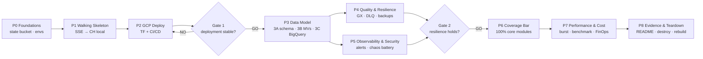
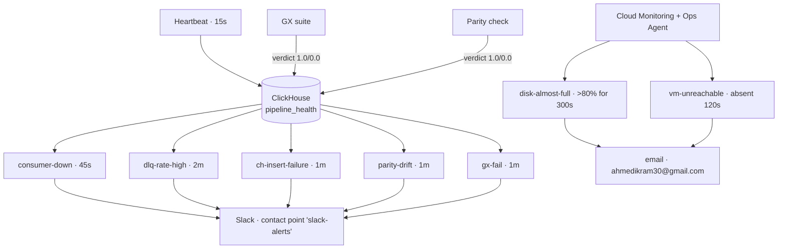
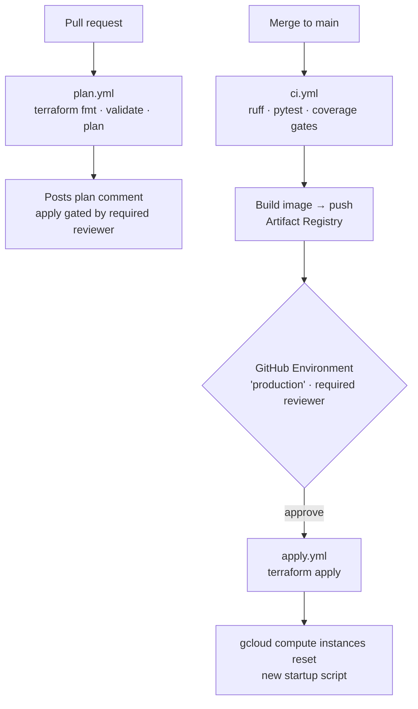

# WikiStream - Deep Dives

Heavy detail extracted from the main README so the top-level story stays recruiter-readable. Everything here is receipt-backed live-system evidence.

**The delivery lifecycle** - every phase gated by a Go/No-Go checkpoint, evidence captured once, everything rebuildable from scratch:



**Why this shape?** Every choice traces to an explicit trade-off analysis (ADR-001…011, full table in [Design Decisions](../README.md#trade-offs-that-mattered)) - ClickHouse over Postgres/BigQuery-as-engine (OLAP-native, no per-second billing on a continuous dashboard), native SSE over Kafka (the source is a single ordered feed; proven on a sibling project), a single VM over GKE (right-sized for ~40K events/min), and systemd timers over Cloud Scheduler (the database the jobs query lives on the same host).

## Component Deep Dives

### 1. Ingestion & SSE Client

The consumer is a single async loop with three independent concerns, all testable in isolation.

**SSE parsing** (`src/sse.py`, ~30 lines, stdlib-only):

| Behavior | Detail |
| --- | --- |
| Protocol | WHATWG Server-Sent Events, strict UTF-8, trailing-`\r` hold for split frames |
| Resume | Sends `Last-Event-ID`; the Wikimedia server accepts the **JSON-array** id and replays from the first event strictly after it |
| Backoff | `SSE retry:` / HTTP `Retry-After` → `min(max(retry_ms/1000 if set else 1.0, retry_after), 30.0)` - capped at 30s, never thundering |
| Reconnect log contract | `connected url=… / reconnect reason=… / insert_failed=… / inserted events=<n> total=<cum>` - greppable, alertable |

**Transport** - `httpx2` (the maintained continuation of the stalled `httpx` project; Pydantic stewarded), pinned `==2.10.0`. Streaming response with a per-chunk parse boundary.

**Model validation** (`src/models.py`) - the real shape of the feed surprised us: Wikimedia sends `timestamp` as **integer epoch seconds** (`{"timestamp": 1786626323}`), not ISO-8601, and the SSE `id:` is a **JSON array** of topic/partition cursors, not a plain number. `validate_timestamp` accepts `int | float`, coerces epoch → UTC datetime, tolerates naive input and a 5-minute clock skew. A 21-test matrix pins the pydantic coercion behavior (lax-mode bools coerce everything; `str` does *not* coerce ints).

### 2. ClickHouse Schema & Migrations

**Migration runner** - plain `bash` + ClickHouse HTTP API (no client binary in the container), `set -euo pipefail`, a 30×2s readiness wait, and a `default.schema_migrations` bookkeeping table. Idempotent by design: re-running on a clean database applies exactly once (`SKIP 000 / APPLY 001 / SKIP 002 / SKIP 003`); re-running against an applied schema skips everything.

**`001_raw_events`** - the full typed schema:

```sql
CREATE TABLE default.raw_events (
    inserted_at   DateTime64(3, 'UTC'),
    event         String,
    event_type    String MATERIALIZED JSONExtractString(event, 'type'),
    wiki          String MATERIALIZED JSONExtractString(event, 'wiki'),
    title         String MATERIALIZED JSONExtractString(event, 'title'),
    user          String MATERIALIZED JSONExtractString(event, 'user'),
    is_bot        UInt8  MATERIALIZED JSONExtractBool(event, 'bot'),
    length_new    UInt32 MATERIALIZED JSONExtractUInt(event, 'length', 'new'),
    length_old    UInt32 MATERIALIZED JSONExtractUInt(event, 'length', 'old'),
    event_timestamp DateTime64(3, 'UTC')
                  MATERIALIZED parseDateTime64BestEffort(JSONExtractString(event, 'timestamp'))
)
ENGINE = MergeTree
PARTITION BY toYYYYMMDD(inserted_at)
ORDER BY (inserted_at, sipHash64(event))
TTL inserted_at + INTERVAL 30 DAY
SETTINGS max_suspicious_broken_parts = 1000
```

| Setting | Value | Rationale |
| --- | --- | --- |
| Partitioning | Daily on `inserted_at` | Cheap partition-level drops at TTL, time-travel windowed queries |
| Sort key | `(inserted_at, sipHash64(event))` | The hash gives the dedup key a 64-bit collision-safe spread |
| TTL | 30 days (ADR-006) | Live dashboard only needs recent data; warehouse covers history |
| `max_suspicious_broken_parts` | 1000 | Survives unclean shutdowns without refusing to merge (learned the hard way) |

Sample of real persisted rows:

<p align="center">
  
  <em>Actual rows from the live table - categorize/edit/new events across commons, zh, wikidata projects.</em>
</p>

### 3. Materialized Views

Three views, all `ENGINE = SummingMergeTree`, all created **without `POPULATE`** (history starts at deploy; refreshes continuously at ingestion rate):

| View | Grain | Measures | Purpose |
| --- | --- | --- | --- |
| `004_mv_edits_per_minute` | `(minute, wiki, is_bot)` | `count() AS edits`, `sum(length_new - length_old) AS bytes_delta` | Edit velocity + bytes churn |
| `005_mv_top_pages_per_minute` | `(minute, title, wiki)` | `count() AS edits` | Composite key so identical titles on different wikis never collapse |
| `006_mv_edit_sizes_per_minute` | `(minute, bucket)` | `count() AS edits` | 6 size buckets via `multiIf`: `0 / 1-10 / 11-100 / 101-1000 / 1001-10000 / 10000+` |

**Exactness is verified, not assumed** - the MV equivalence suite asserts `MV == raw` on live data:

```
sum(edits)      MV 5821     == raw 5821
sum(bytes_delta) MV 4693117 == raw 4693117     (exact, TSVWithNames)
```

MV row counts are deliberately **never** compared to raw counts - `SummingMergeTree` row counts are merge-state-dependent, which is also why the warehouse parity layer compares SUMS (see §5).

### 4. Grafana Dashboards

`wikistream-live` ("WikiStream Live Analytics"), provisioned as code, 10s refresh:

| Panel | Query source | Verified output |
| --- | --- | --- |
| Edit velocity | `004_mv_edits_per_minute` | 30 rows (15 min × bot/human) |
| Bot vs human | `004` ratio | 2 series |
| Top pages | `005_mv_top_pages_per_minute` | 10 rows |
| Project language | `004` grouped by wiki | 15 rows |
| Edit-size histogram | `006_mv_edit_sizes_per_minute` | 6 buckets (1h sum up to 6,008) |

Plugins pinned via `GF_PLUGINS_PREINSTALL`: `grafana-clickhouse-datasource@4.20.0` and `grafana-bigquery-datasource@3.2.0` (the `GF_INSTALL_PLUGINS` path is broken in Grafana 13.1.1 - 404 crash-loop - another hard-won pin).

### 5. BigQuery Warehouse

The warehouse tier answers "what happened last month?" without keeping raw data forever.

| Piece | Design |
| --- | --- |
| Dataset | `wikistream` (US), 5 tables: `kpi_edits_hourly`, `kpi_top_pages_hourly`, `kpi_edit_sizes_hourly`, `raw_events_sample`, `export_runs` |
| Partitioning | `time_partitioning { DAY }` on every KPI table; `kpi_edits_hourly` additionally clustered on `wiki` |
| Export | systemd timer **:00** - `formatDateTime` RFC3339, `if(is_bot,'true','false')` bool cast, deterministic 10% sample via `sipHash64(event) % 100 < 10` |
| Load | `gcloud storage cp` → staging bucket (7-day Delete lifecycle) → `bq load` `NEWLINE_DELIMITED_JSON` |
| Parity | systemd timer **:05** - compares **SUMS** (edits, bytes) between CH window and BQ tables, writes a 1.0/0.0 verdict into `pipeline_health`; failed parity fires `parity-drift` |
| Freshness | Grafana panel 6: `TIMESTAMP_DIFF(CURRENT_TIMESTAMP(), MAX(exported_at), MINUTE)` - green < 60, orange 60-120, red > 120 |

**Proven end-to-end:** export run at 18:00:19 → 18:03:33 delivered `rows_edits=272, rows_top_pages=40,870, rows_sizes=6, rows_raw_sample=10,516`; the parity check confirmed `edits=48,833 / bytes_delta=43,943,656` match ClickHouse exactly; freshness panel read 14 minutes. When parity *did* fire during chaos testing (a windowed DELETE of the BQ tables), the remediation - re-run `export.sh`, which reloads the identical window - restored `verdict 1.0` and the alert cleared.

<p align="center">
  
  <em>The BigQuery dataset in the GCP console - 5 partitioned tables, hourly loads, verified parity.</em>
</p>

### 6. systemd Automation

The batch plane is eight unit files, all installed by `boot.sh`:

| Timer | Schedule | `Persistent=true` | Job |
| --- | --- | --- | --- |
| `wikistream-backup.timer` | :20 hourly | yes | Native `BACKUP DATABASE` → GCS, keep-last-2 |
| `wikistream-gx.timer` | :30 hourly | yes | Great Expectations suite on the latest hour |
| `wikistream-export.timer` | :00 hourly | yes | CH → GCS → BigQuery export |
| `wikistream-parity.timer` | :05 hourly | yes | SUMS parity + freshness verdict |

Plus a **15-second consumer heartbeat** that writes deltas (`inserted_delta`, `dead_lettered_delta`, `insert_failed_delta`, `duplicates_skipped_delta`) into `pipeline_health` - the single source every alert queries.

### 7. Data Quality - Pydantic + Great Expectations

Two layers, deliberately split (ADR-005):

1. **Inline (sub-second):** Pydantic v2 validation at the edge - type, timestamp parseability, schema shape. Failures route to `dead_letter`, never to the store.
2. **Batch (hourly):** Great Expectations `0.18.22` against a rolling window, sampling **5%** of ~1.2M rows/hour.

The GX suite checks (all tuned to *measured* live bounds, not guessed ones):

| Expectation | Measured live bound | Why |
| --- | --- | --- |
| Row count in range | `(50,000, 5,000,000)` | Full-window pre-check; VM volume is 1.2M rows/hr, not the planned 160K |
| Nulls = 0 | wiki, title, event_type, is_bot, length_new, event_timestamp | Schema-on-write should make nulls impossible |
| `event_type` domain | `{edit, new, log, categorize}` | Drift detection |
| Median lag | `< 300s` between `event_timestamp` and `inserted_at` | Freshness - the pipeline must keep up |
| Max skew | `< 300s` | Clock anomalies |
| Wiki cardinality | `> 100` distinct | Live feed sanity |
| Bot ratio | `∈ (0.05, 0.95)` | Measured mean is 0.493 |

Sampling uses `rand() < int(0x100000000 * rate)` - `%`-based sampling breaks through GX's SQLAlchemy wrapper. A failed suite **exits 1** (the alert hook) and writes a 0.0 verdict to `pipeline_health`.

### 8. Resilience - Dead Letter, Resume, Dedup

**Dead-letter table** (`dead_letter`, TTL 90 days):

- Written **only** from the validation branch - invalid JSON, unparseable timestamps, pydantic errors. Transport failures never land here (keeps the DLQ-rate alert semantically honest).
- Synchronous insert (`async_insert=0`) + **at-least-once**: a failed DL insert re-runs after reconnect.
- Proved: `dead_letter GROUP BY reason → 4× timestamp_missing, 1× validation:invalid_json, 4× timestamp_unparseable`, with `dead_lettered=4, insert_failed=0`.

**Durable resume** - the cursor lives on the ch-data disk (`/mnt/ch-data/state/consumer_state.json`), written atomically via `tmp + os.replace`. The durable id **advances only on a successful flush or DL insert** - never on receipt. Graceful shutdown joins within 10s.

> **The SIGKILL proof:** `sudo docker kill` the consumer mid-stream (exit 137). On restart it emitted `resumed_from=[…]`, replayed the kill-window redeliveries into the dedup ring, and logged `inserted events=1000 total=4370 duplicates_skipped=85→150` - **zero loss, zero duplicates**.

**Batcher + dedup ring:** `EventBatcher(max_rows=1000, max_age_s=5.0, dedup_capacity=50_000)` - flush at ≥1,000 rows or ≥5s, single `async_insert=1, wait_for_async_insert=0` insert. A `deque(maxlen=50_000)` + set mirror (~20 min at 44 ev/s) absorbs the server's own replays: live runs show `duplicates_skipped=3/7/10` catching native redeliveries. On flush exception, rows are dropped **at-most-once and counted** - never silently.

### 9. Backup & Restore

| Piece | Detail |
| --- | --- |
| Backup | `BACKUP DATABASE default TO Disk('backups', '<name>')` - native ClickHouse, `case *BACKUP_CREATED*` completion guard |
| Upload | `gsutil -q -o GSUtil:parallel_composite_upload_threshold=0 cp -r` → `gs://wikistream-505003-backups/` (composite uploads need an object-delete permission the SA intentionally lacks) |
| Pruning | keep-last-2 locally + GCS bucket lifecycle (Delete, age 2 days) |
| Cost | ~3.4s CPU per backup |
| Restore | **Verified once, exactly:** restored `backup-20260813-165326` from GCS → `restore_check.raw_events` `count() WHERE inserted_at <= 16:53:28.084` = **4,514,837 == 4,514,837 exact** |

<p align="center">
  
  <em>GCS in the console - the backups bucket (keep-last-2, age-2-day lifecycle) and the BigQuery staging bucket (7-day lifecycle).</em>
</p>

### 10. Observability & Alerting

Two **non-overlapping** layers (ADR-010) - app/pipeline vs infrastructure:



| Rule | Trigger | Proven in chaos run |
| --- | --- | --- |
| `consumer-down` | Heartbeats absent (45s) | Fired 01:01:37, inactive 01:04:41 after resume |
| `dlq-rate-high` | Dead-letter delta ratio → 1.0 (2m) | Fired 01:14:30 on 8,211 injected malformed rows, Slack delivered, cleared ~01:24 |
| `ch-insert-failure` | `insert_failed_delta > 0` (1m) | Fired 01:24:00 with ClickHouse down 90s (182K failed inserts absorbed, no crash) |
| `parity-drift` | BQ vs CH SUM mismatch (1m) | Fired 01:40:34 after a windowed BQ DELETE; cleared 01:48:16 after re-export |
| `gx-fail` | GX exit ≠ 0 (1m) | Forced failure produced the exact error payload and a 0.0 verdict |

Every rule fired, **Slack and email delivery confirmed by the recipient**, then each was verified cleared. The chaos battery ran **8/8 injections** (consumer kill, DLQ flood, ClickHouse outage, parity drift, GX forced-fail, 17GB disk fill to 86%, VM stop/unreachable, firewall lockdown) - each fired its alert, was remediated, and cleared.

<p align="center">
  
  <em>Slack alert delivery - the alert fired, then cleared, end-to-end on the live system.</em>
</p>

<p align="center">
  
  <em>Cloud Monitoring email alerts for disk-almost-full and vm-unreachable.</em>
</p>

### 11. Performance - Burst & Benchmark

**Burst harness** (`scripts/burst_test.py`) - stdlib-only asyncio (deliberately not k6), the *real* consumer binary as a subprocess, fresh state per level, zero consumer code changes, 1% malformed traffic by design. Against a baseline measured from the real dataset (50.2M rows at capture; the store passed 58.9M by receipt time - it never stops growing):

| Level | Target | Sent | Valid | Dead-lettered | Drops |
| --- | --- | --- | --- | --- | --- |
| baseline | 565.5 ev/s | - | - | - | - |
| smoke | 200/s | 998 | 992 | 6 | **0** |
| 2× | 1,131/s | 67,849 | 67,196 | 653 | **0** |
| 5× | 2,828/s | 169,639 | 167,889 | 1,750 | **0** |
| 10× | 5,655/s | 339,252 | 335,870 | 3,382 | **0** |

**577,738 events through the real pipeline, zero drops at every multiple.** The 10× level sustained **5,655 ev/s for 60s - 2.08× the real observed peak minute (2,719 ev/s)** - and no ceiling appeared below 10× baseline. Dead-letter routing matched injection exactly per reason at every level; the durable cursor matched the flushed valid count exactly.

**Query benchmark** - real 50.2M-row dataset, client-side `time.perf_counter`, 1 warmup + 5 timed runs, 24h window, canonical dashboard queries:

| Query | Raw p50 | MV p50 | Speedup | Rows scanned |
| --- | --- | --- | --- | --- |
| Q1 edit velocity | 92,837 ms | 6,198 ms | **15.0x** (p99 13.2x) | **46.8M → 0.23M (~200x fewer)** |
| Q2 top pages | 218,791 ms | 58,026 ms | **3.8x** (p99 3.5x) | 18.0M → 15.1M |

Q2's smaller scan reduction is expected - the win there is pre-aggregated narrower rows (no `JSONExtract`, no minute re-grouping).

> Absolute query times include ~40 ms network RTT (Mac → us-east1); the raw-vs-MV delta is the signal.

### 12. Cost / FinOps

Itemized from the real `gcloud` inventory at us-east1 rates - no estimates:

| Item | Monthly |
| --- | --- |
| e2-medium VM (1 × 2 vCPU / 4GB, `$0.0359/h`) | $26.21 |
| Boot disk 50GB pd-standard | $5.00 |
| ch-data disk 50GB pd-standard | $5.00 |
| Static external IP | $3.65 |
| GCS (backups 46.4GB age-2d + staging 8.8GB age-7d) | ~$1.11 |
| 3 × Secret Manager secrets | $0.18 |
| BigQuery (5 tables, <0.1GB) | < $0.50 |
| Artifact Registry + Cloud Monitoring | ~$0 |
| **Total run-rate** | **≈ $41.65/mo** |

- **$300 trial ≈ 7.2 months** of full run-rate.
- VM + disks + IP = **$39.86 ≈ 96%** of the bill - everything on the teardown list (ADR-001).
- **Residual post-teardown ≈ $1.79/mo** (buckets, secrets, BQ dataset).

## Testing

| Layer | Result |
| --- | --- |
| Full suite (`pytest --cov=src`, all 143 incl. 31 ClickHouse integration) | **143 passed, 2 skipped** in 66s |
| Coverage - consumer core | **99.38% (484 stmts, 3 miss)** |
| Coverage - 6 business-critical modules | **262/262 = 100.00%** (`sse`, `models`, `batcher`, `dead_letter`, `heartbeat`, `healthcheck`) |
| Coverage - `gx/suite.py` | **89/89 = 100%** (parallel-mode `coverage combine`) |
| Integration (`-m ch`, real ClickHouse) | 31 tests: migrations, MV equivalence, kill/resume, DLQ, healthchecks |
| GX suite tests | 17 green - drive the real `suite.py` as a subprocess and assert the exit-code contract |
| CI gate | Per-module `--cov-fail-under=100` + overall `--cov-fail-under=90` - **blocks merges** |

The 2 skips are `pytest.importorskip("great_expectations")` - GX pins Python 3.12 (no cp313 wheels) while the consumer runs 3.13/3.14; those tests run green under the GX project's own env. The gate itself was proven: deleting one covered line from `sse.py` made CI exit 1 with 31 failures; restoring it → exit 0, 112 passed, 262/262.

## Infrastructure (Terraform)

| Module | Resources | Notes |
| --- | --- | --- |
| `network` | VPC, subnet `10.0.0.0/24`, **4 firewall rules** | Ports 22/3000/8123 restricted to one IP (`allow_internal` for the /24); a `null_resource` deletes GCP's default allow-all rules |
| `compute` | Static IP, e2-medium, 50GB boot, ubuntu-2404 + OSLogin, startup script | `startup.sh` is idempotent: installs agent/CLI, renders `.env`, runs migrations, `compose pull && up` |
| `iam` | VM SA (secretAccessor ×2, monitoring writer), deploy SA (9 roles) | Least-privilege; a 22-row IAM review matrix documents every binding (`docs/planning/iam-review.md`) |
| `bigquery` | Dataset + 5 tables, staging bucket | Dataset WRITER + project-scoped `bigquery.jobUser` (queries need `jobs.create`); ADR-010 |
| `storage` | Artifact Registry reader | Scoped to the single image repo |
| `monitoring` | Ops Agent policies: disk-almost-full, vm-unreachable | Email channel; agentless uptime check |
| `backups` | Backups bucket + IAM | Legacy-bucket-reader role; 2-day lifecycle |

State lives in `gs://wikistream-505003-terraform-state` (bootstrap config, local state, **never destroyed**). Terraform ~1.15 / Google provider 7.43.

<p align="center">
  
  <em>The VM - e2-medium, static IP, both disks, OS Login.</em>
</p>

<p align="center">
  
  <em>The VPC network - custom subnet and the four lockdown firewall rules.</em>
</p>
## CI/CD Pipeline

Three workflows, all using Workload Identity Federation (no stored GCP keys):



| Workflow | Trigger | Guard |
| --- | --- | --- |
| `plan.yml` | Any PR | Auto-comment with the plan diff |
| `ci.yml` | Push, PRs, manual | Lint + tests + **coverage gates block** |
| `apply.yml` | Push to main, after CI | `production` Environment, required reviewer, concurrency per-ref |

The apply path does double duty as the deploy mechanism: `startup.sh` edits force a VM recreate (`metadata_startup_script` is `ForceNew` in the provider), and a boot-time `git fetch origin && git reset --hard origin/HEAD` guarantees the VM runs exactly the merged tree.

<p align="center">
  
  <em>CI - lint, tests, coverage gates, image build.</em>
</p>

<p align="center">
  
  <em>plan.yml - automatic plan comment on every PR.</em>
</p>

<p align="center">
  
  <em>apply.yml - gated apply, then VM reset.</em>
</p>
## Security Model

| Layer | Mechanism |
| --- | --- |
| Credentials | **Zero static keys.** WIF for CI; Secret Manager for `clickhouse-password`, `grafana-admin-password`, `slack-webhook-url` (81-byte webhook URL) |
| Network | Firewall allows only ports 22/3000/8123 **from a single IP**; internal /24; GCP default allow-all rules deleted by Terraform. Cloud Shell is refused, home IP passes |
| VM access | OS Login (`user:jess154lacroix@gmail.com`), no password SSH |
| IAM | Dataset-scoped BQ WRITER + project-scoped `jobUser`, repo-scoped AR reader, minimal SA roles - 22-row review matrix with recorded deviations (D1-D6) |
| Data | Raw TTL 30d, dead-letter 90d, `pipeline_health` 7d; backups age 2d |
| Secrets in state | `secrets.tf` generates `random_password` → Secret Manager only; rotation noted as a Phase-5 follow-up |

<p align="center">
  
  <em>IAM - the deploy service account in the GCP console; every binding reviewed in the 22-row matrix.</em>
</p>
## Project Structure

```
wikistream/
├── consumer/                 # Async SSE consumer + ClickHouse client
│   └── src/
│       ├── consumer.py       # Main loop: connect, parse, validate, batch, insert
│       ├── sse.py            # WHATWG SSE parser (stdlib only)
│       ├── models.py         # Pydantic event models + timestamp coercion
│       ├── batcher.py        # 1k-row / 5s batching + dedup ring
│       ├── dead_letter.py    # At-least-once DLQ writer
│       ├── heartbeat.py      # 15s pipeline_health writer
│       └── healthcheck.py    # Docker healthcheck entrypoint
├── gx/                       # Great Expectations 0.18.22 suite (Python 3.12)
│   └── suite.py              # 11 expectations on a rolling window, exit-code contract
├── migrations/               # Versioned .sql migrations (000-008) + bash runner
├── warehouse/                # Export/parity scripts + SQL + systemd units
├── infra/
│   ├── bootstrap/            # State bucket + WIF (local state, never destroyed)
│   └── main/                 # network/compute/iam/bigquery/storage/monitoring/backups
├── scripts/                  # burst_test.py, etc.
├── tests/                    # pytest suites (unit + -m ch integration)
├── docs/                     # implementation log, master plan, vision + ADRs
├── assets/                   # Screenshots & terminal evidence
├── docker-compose.yml
└── .github/workflows/        # ci.yml, plan.yml, apply.yml
```
