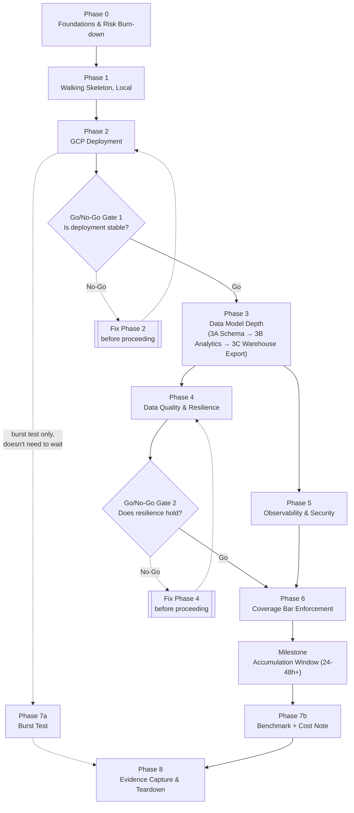

# WikiStream — Master Plan

**Status:** Locked, pending Implementation Phase Plans
**Position in the document hierarchy:** Research Notes (why the project exists) → Vision & ADR (what it is, why each architectural decision was made) → **this document** (how it gets built, in what order) → Implementation Phase Plans (exact tasks, commands, file structure, tests — one per phase below).
**What this document does not do:** re-decide anything locked in the ADR, introduce new technology, or specify implementation detail. Every phase below traces back to specific ADR numbers rather than restating their content — see the traceability matrix in §6.

**Revision note:** Merges two parallel threads — the GCP breadth additions agreed alongside the ADR's v2→v3 revision (Artifact Registry, Cloud Monitoring), and a structural review pass (explicit Phase Dependency Table, Phase 3 split internally into 3A/3B so it doesn't become a dumping ground, and two Go/No-Go gates — after Phase 2 and after Phase 4 — since passing a phase's own exit criteria doesn't guarantee the foundation under it is sound enough to keep building on). Section numbers shifted once to fit the new Go/No-Go section in; internal cross-references below are corrected accordingly. Also revised §8: evidence is collected once, in Phase 8, before teardown — nothing is captured during the phases themselves. On 2026-08-10, Phase 3 gained a third internal block — **3C Warehouse Export (BigQuery)** — as a deliberate in-scope decision (ADR-003 amendment): the same event stream feeds a warehouse tier for CV-market coverage of BigQuery. On the same date the 3C block gained two live downstream consumers (ADR-010 amendment): a Grafana BigQuery-datasource freshness panel and a scheduled hourly parity check verifying the warehouse tracks the engine.

## 1. Methodology (as confirmed, not re-litigated)

- **Walking skeleton, not horizontal layers.** The thinnest possible end-to-end slice (bare consumer → bare table → bare panel) ships first, entirely to convert the risk register's assumptions into facts while they're still cheap to be wrong about. Depth (full schema, data quality, observability, hardening) is added in passes afterward.
- **Local-first, then GCP.** The skeleton is built and proven against a local docker-compose stack before any GCP billing account exists — the $300/90-day trial clock starts on account creation, not on first use, so it isn't opened until Phase 2 is actually ready to start.
- **No effort/time sizing.** Considered and declined — the timeline constraint was already dropped for this project; sizing would add ceremony without a decision it changes.

## 2. Critical Path

Phases 4 and 5 both depend only on Phase 3, not on each other — do them in either order, or interleave. Phase 7's burst test only needs a deployed consumer (Phase 2) and doesn't need to wait for the rest of the chain; the benchmark and cost note need real accumulated data, so they wait for the Accumulation Window milestone regardless of how far ahead the burst test gets. Everything else is a strict chain, now with two explicit decision points rather than an assumed straight line — see §4.

## 3. Phase Dependency Table

| Phase    | Depends On              | Blocks     |
| -------- | ------------------------ | ---------- |
| Phase 0  | None                    | 1–8        |
| Phase 1  | 0                       | 2–8        |
| Phase 2  | 1                       | 3–8        |
| **Gate 1** | **2**                 | **3**      |
| Phase 3  | 2, Gate 1               | 4,5,6,7b,8 |
| Phase 4  | 3                       | 6,7b,8     |
| Phase 5  | 3                       | 6,8        |
| **Gate 2** | **4**                 | **6**      |
| Phase 6  | 4, 5, Gate 2            | 7b,8       |
| Phase 7a | 2                       | 8          |
| Phase 7b | 6 + Accumulation Window | 8          |
| Phase 8  | All                     | None       |

Gates aren't phases — they don't produce deliverables of their own — but they sit on the critical path exactly like one, so they're listed here rather than only in prose.

## 4. Go/No-Go Gates

Two checkpoints that ask "should this continue as designed," not just "did the phase meet its own exit criteria." A phase can pass its own checklist while the ground underneath it is still shaky — these exist to catch that before six more phases get built on top of it.

**Gate 1 — after Phase 2, before Phase 3.**
*Question:* Is the GCP deployment fundamentally stable, not just technically working once?
*Go:* Phase 2's exit criteria hold across more than one apply/destroy cycle; the CI/CD gate (or its `workflow_dispatch` fallback) works reliably end-to-end; the skeleton survives unattended without manual babysitting.
*No-Go:* Repeated deployment flakiness, an approval-gate mechanism that doesn't actually work, or infrastructure instability that only surfaced once real GCP conditions were involved (as opposed to Phase 1's local environment).
*Response:* Stop. Fix Phase 2's foundation before starting Phase 3's full data model — building schema, materialized views, and a dashboard on top of infrastructure that isn't trustworthy just means redoing it later with more sunk cost attached.

**Gate 2 — after Phase 4, before Phase 6.**
*Question:* Does resilience actually hold, not just exist in config?
*Go:* Crash recovery, malformed-event handling, and backup restore have each been deliberately tested and passed, per Phase 4's exit criteria.
*No-Go:* Any of the three doesn't reliably hold — the consumer doesn't recover cleanly from an induced crash, GX's fallback (if the SQLAlchemy path was broken) isn't actually solid, or a restored backup doesn't match.
*Response:* Stop. Fix resilience before enforcing the coverage bar or starting the Accumulation Window — every hero metric and benchmark number from Phase 7b/8 is only meaningful if the pipeline it's measured against is actually resilient, not merely instrumented to look like it is.

## 5. Phases

### Phase 0 — Foundations & Risk Burn-Down

**Objective:** Stand up the repo skeleton and resolve every risk-register item (Vision §8) that's cheap to check now and expensive to discover wrong later — before any feature code commits to an assumption. No production feature code should survive. Phase 0 unchanged; everything here is disposable by design.
**Prerequisites:** None — entry point.
**Deliverables:** Repo directory skeleton (structure only); Terraform state-bucket bootstrap applied once, locally (ADR-007); a documented yes/fallback answer on GitHub Environments required-reviewers availability (ADR-008); a throwaway spike proving GX's `[clickhouse]` extra connects and runs one expectation against a local ClickHouse container (ADR-005); the "business-critical modules" boundary for the coverage gate written down as a concrete list (ADR-009), even though most of the code it names doesn't exist yet.
**Implementation approach:** Each item is a narrow, disposable spike or one-time setup step, not integrated feature work.
**Verification gate:** Every burn-down-able risk from Vision §8 has a written yes/no/fallback answer, not left open.
**Risks/rollback:** If GX-via-SQLAlchemy is broken, ADR-005's native-SQL fallback is adopted now, cheaply. If GitHub Environments isn't available, ADR-008's `workflow_dispatch` fallback is adopted now, so Phase 2's CI/CD isn't built twice.
**Exit criteria:** Repo skeleton exists; state bucket bootstrapped; both spikes resolved; module boundary documented.

### Phase 1 — Walking Skeleton, Local

**Objective:** Prove the core premise — real, continuous connection to the actual Wikimedia stream, landing in ClickHouse, visible on a Grafana panel — end-to-end, locally, before any GCP spend.
**Prerequisites:** Phase 0 exit criteria met.
**Deliverables:** Minimal async consumer against the real `recentchange` stream (no batching sophistication yet); one raw ClickHouse table (no MVs); one Grafana panel reading directly off it; all via local docker-compose.
**Implementation approach:** Deliberately skip Pydantic depth, GX, dead-letter routing, alerting, IaC, and CI/CD — all addressed in later phases against their own ADRs. The only question this phase answers is "does the core premise hold."
**Verification gate:** Stays connected to the live stream, unattended, for a sustained multi-hour period, with the panel visibly updating.
**Risks/rollback:** If Wikimedia's actual event shape, rate, or SSE behavior meaningfully differs from ADR-003/004's assumptions, this is the cheap place to find out — it affects implementation detail, not the architecture itself.
**Exit criteria:** Live data flows from Wikimedia to a visible panel, unattended, in a sustained local run. The walking skeleton can be destroyed and recreated locally (`docker compose down && up`) without manual intervention.

### Phase 2 — GCP Deployment of the Skeleton

**Objective:** Move the proven skeleton onto real GCP infrastructure via Terraform, and exercise the CI/CD approval-gate pattern for the first time.
**Prerequisites:** Phase 1 exit criteria met; Phase 0's GitHub Environments finding in hand.
**Deliverables:** Main Terraform config (network/compute/iam/storage per ADR-007) provisioning the `e2-medium` VM and the Artifact Registry repository; CI builds the consumer's image and pushes it to that repository, with the VM's service account granted scoped `artifactregistry.reader` (ADR-008); the docker-compose stack running on the VM, pulling the consumer image from Artifact Registry; the `plan`/gated-`apply` CI workflow (or its fallback) exercised at least once end-to-end; Secret Manager wired for whatever credentials exist so far.
**Implementation approach:** Deploy the *same* skeleton from Phase 1 — this phase proves the deployment path, not new functionality. From here on, GCP is the live environment; later phases build directly against it.
**Verification gate:** A PR triggers automatic plan; merge triggers the gated apply; CI's image push to Artifact Registry succeeds and the VM pulls it; the VM reproduces Phase 1's live-data-to-dashboard result on real infrastructure; a full destroy-and-reapply cycle completes without leftover resources or manual cleanup.
**Risks/rollback:** First point real cost accrues. Nothing valuable has accumulated in ClickHouse yet, so `terraform destroy` and retry is cheap if something's misconfigured — better to find that here than after Phase 4's work is layered on top.
**Exit criteria:** Skeleton runs unattended on GCP, reachable per ADR-010's firewall rule, CI/CD gate proven functional. → **Go/No-Go Gate 1 applies here (§4) before Phase 3 begins.**

### Phase 3 — Data Model Depth

**Objective:** Replace the skeleton's single table and single panel with the full data model (ADR-006), complete KPI dashboard, and a warehouse tier. Five real deliverables live in this one phase (schema, MVs, dashboards, TTL, warehouse export) — internally sequenced as three blocks so it doesn't become a dumping ground. This is an internal split for the eventual Phase 3 Implementation Plan to expand on, not a new numbered phase; nothing else in the critical path or dependency table changes.
**Prerequisites:** Phase 2 exit criteria met and Go/No-Go Gate 1 passed.

**3A — Schema:**

- Versioned, numbered DDL migrations for the full raw-events schema, applied in order.
- 30-day TTL applied to raw events.
- Internal micro-gate before 3B starts: migrations apply cleanly to a clean database and are re-runnable; the TTL clause is confirmed present.

**3B — Analytics** *(depends on 3A within this phase — don't build materialized views against a schema that's still in flux):*

- Materialized views (`AggregatingMergeTree`/`SummingMergeTree`) for every rolling KPI.
- The complete set of rolling KPI panels.
- Dashboards defined as code via the `grafana-clickhouse-datasource` plugin's provisioning support (ADR-010).

**Implementation approach:** Build the exact KPI list already fixed in the research notes/Vision doc — this phase implements a known list, it doesn't discover new panels mid-build (see cross-phase risk, §7).
**Verification gate:** 3A's migrations are idempotent and re-runnable from clean before 3B starts. Each MV's output is then spot-checked against an equivalent raw-table query for the same window, confirming correct aggregation, not just execution.
**Risks/rollback:** A silently-wrong MV is ADR-006's named risk — the spot-check exists specifically to catch this before the accumulation window trusts it.
**Exit criteria:** All KPI panels render correctly against real data; migrations are versioned and re-runnable from clean.

**3C — Warehouse Export (BigQuery)** *(depends on 3B within this phase — export analytics-shaped data, never the in-flux raw schema):*

- A dedicated hourly export (systemd timer): SELECTs the MV/KPI aggregate tables plus a sampled slice of raw events via the existing `clickhouse-connect` client, writes JSONL to a GCS staging bucket, and loads it into a BigQuery dataset via `bq load`. Native ClickHouse BACKUP archives (ADR-006) stay for disaster recovery — they aren't the export source.
- Terraform: a new `bigquery` module (fifth module beside network/compute/iam/storage — ADR-007 extended) provisioning the BigQuery dataset + tables and the GCS staging bucket, with the VM's service account scoped to dataset `dataEditor` only (ADR-010 least-privilege posture — no broad BQ roles).
- BigQuery is a batch-query tier, not the hot path: Grafana keeps reading ClickHouse; BigQuery is queried via `bq` CLI/console for warehouse evidence.
- The warehouse tier is a live, visible system, not a dead-end dump: Grafana gains a `google-bigquery` datasource (GCE default-service-account auth — the VM SA's dataset-scoped `dataEditor` covers its queries; plugin preinstalled via `GF_PLUGINS_PREINSTALL`, `GF_INSTALL_PLUGINS` is broken in Grafana 13.1.1) with a **warehouse-freshness panel** (hours since last export) alongside the ClickHouse panels.
- A **scheduled parity check** (systemd timer, hourly at `:05` — 5 minutes after the `:00` export so it validates the latest window) queries BigQuery vs ClickHouse for the latest completed hour — freshness lag + row counts — and exits non-zero on drift; the alert is wired in Phase 5.

**Implementation approach:** Added 2026-08-10 as a deliberate in-scope decision (ADR-003 amendment) — BigQuery is a near-universal DE job-description keyword, and a warehouse tier fed by the project's own real stream is defensible interview evidence. The engine decision is untouched: ClickHouse remains the primary real-time store.
**Verification gate:** BigQuery dataset rows grow in lockstep with the source; a sample window queried in BigQuery matches the equivalent ClickHouse MV query for the same window (same spot-check discipline as 3B); the parity timer runs green at `:05` each hour and the freshness panel renders in Grafana.
**Risks/rollback:** Export drift (BigQuery falling behind ClickHouse) — the hourly cadence + freshness/parity spot-check catches it; cost is negligible at this volume (fractions of a cent/day).
**Exit criteria:** BigQuery holds real data by the end of the Accumulation Window; the export path is re-runnable from clean.

### Phase 4 — Data Quality & Resilience

**Objective:** Wire in and *prove* everything ADR-005, ADR-004's resilience details, and ADR-006's in-window backup cadence promised but the skeleton didn't yet need.
**Prerequisites:** Phase 3 exit criteria met. Independent of Phase 5.
**Deliverables:** Pydantic inline validation on the real event shape; `dead_letter` table live; GX batch suite running on its systemd timer; Docker healthchecks and `restart: unless-stopped` + systemd supervision exercised, not just configured; in-window ClickHouse backup cadence running; at least one backup restored and spot-checked.
**Implementation approach:** This phase proves resilience claims, not just implements them — an untested healthcheck or an unrestored backup hasn't demonstrated anything.
**Verification gate:** Deliberately kill the consumer and confirm unattended recovery; deliberately feed a malformed event and confirm it lands in `dead_letter` instead of crashing the pipeline; restore a backup and confirm the data matches.
**Risks/rollback:** If the GX SQLAlchemy path is broken (flagged possible in Phase 0), ADR-005's fallback is adopted for real here.
**Exit criteria:** Crash recovery, malformed-event handling, and backup restore have each been deliberately tested and passed. → **Go/No-Go Gate 2 applies here (§4) before Phase 6 begins.**

### Phase 5 — Observability & Security Hardening

**Objective:** Implement ADR-010 in full: application-level alerting, infrastructure-level monitoring, least-privilege IAM, firewall.
**Prerequisites:** Phase 3 exit criteria met. Can run before, after, or interleaved with Phase 4.
**Deliverables:** The three named Grafana alert rules (consumer-down, dead-letter-rate threshold, ClickHouse insert failure) firing under test conditions; the Ops Agent installed and the two Cloud Monitoring alert policies (disk-almost-full, VM-unreachable) firing under test conditions; a documented least-privilege IAM review of the VM's service account against actual usage (including the Phase 2 Artifact Registry reader grant); firewall confirmed to reject non-whitelisted IPs.
**Implementation approach:** Same "prove it" standard as Phase 4.
**Verification gate:** Deliberately trigger each Grafana alert condition and confirm it fires; deliberately push disk usage over the alert threshold (e.g., a temporary large dummy file, removed after) and confirm the Cloud Monitoring alert fires, then clears; attempt access from a non-whitelisted IP and confirm rejection.
**Risks/rollback:** None that block other phases — safe to defer without holding up the rest of the plan. See the IP-lockout cross-phase risk (§7) before finalizing the firewall rule's timing.
**Exit criteria:** All five alerts (three Grafana, two Cloud Monitoring) demonstrated firing; least-privilege confirmed; firewall restriction confirmed; Grafana dashboards continue updating during sustained operation.

### Phase 6 — Coverage Bar Enforcement

**Objective:** Close out ADR-009 as a hard CI gate. Tests are written continuously through Phases 1–5, not deferred — this phase turns on enforcement (100% on Phase 0's designated modules, ~90% overall) and closes whatever gaps remain.
**Prerequisites:** Phases 4 and 5 substantially complete, Go/No-Go Gate 2 passed — the module boundary needs real code behind it to measure against.
**Deliverables:** pytest-cov wired into CI with both gates enforced; identified gaps closed; PR-blocking behavior confirmed.
**Implementation approach:** Gap-closing and enforcement, not first-draft test writing.
**Verification gate:** CI actually blocks a deliberately under-covered PR, then passes once fixed.
**Risks/rollback:** If the 100% bar proves genuinely impractical for some path (e.g., only reachable under a real network partition), that's a documented, defensible exception — not a silent scope-down.
**Exit criteria:** Both gates enforced and passing; the gate proven to actually block, not just report.

### Phase 7 — Performance & Cost Validation

**Objective:** Deliver the three confirmed additions: burst test, ClickHouse latency benchmark, cost/FinOps note.
**Prerequisites:** 7a (burst test) needs only Phase 2. 7b (benchmark, cost note) needs the Accumulation Window milestone complete.
**Deliverables:** Burst/backpressure harness and its zero-drop results; latency benchmark (raw scan vs. MV, p50/p99) against real accumulated data; the cost note.
**Implementation approach:** Don't hold 7a hostage to the rest of the chain just because it's grouped here narratively.
**Verification gate:** Burst test demonstrates zero drops at the tested multiple of baseline rate; benchmark numbers come from the real dataset, not synthetic data.
**Risks/rollback:** If the burst test finds a real ceiling lower than hoped, that's a finding to document, not a reason to quietly loosen the test.
**Exit criteria:** All three artifacts produced; results are real measurements.

### Milestone — Accumulation Window (not a build phase)

Starts once Phases 2–5 are stable on GCP. Runs a minimum of 24–48h. Phase 7b and all of Phase 8 depend on this window having elapsed — plan calendar time around it explicitly; it's wall-clock waiting, not work.

### Phase 8 — Evidence Capture & Teardown

**Objective:** Close out the Vision doc's Definition of Done in full.
**Prerequisites:** Accumulation Window complete; Phase 7 complete.
**Deliverables:** All hero metrics recorded with real numbers; dashboard screenshots and a short recorded walkthrough; BigQuery warehouse evidence (sample queries + row counts over the exported dataset); final backup taken and restore-verified once more; README complete (architecture diagram, cost note, CV-ready bullet drafts); `terraform destroy` against the main config (bootstrap bucket excluded); rebuild re-tested at least once from the destroyed state.
**Implementation approach:** This phase's output is entirely evidence — everything before it is disposable once this is done.
**Verification gate:** The Vision doc's Definition of Done, item by item.
**Risks/rollback:** If rebuild-from-destroyed fails, better to find that here than during an actual interview request to "show it live again."
**Exit criteria:** Every Definition of Done item satisfied; infra destroyed; rebuild proven at least once.

## 6. ADR Traceability

| ADR | Implemented in |
| --- | --- |
| ADR-001 — Deployment lifetime & teardown | Phase 8; referenced throughout |
| ADR-002 — Compute topology | Phase 2 |
| ADR-003 — ClickHouse, self-hosted (amended 2026-08-10: BigQuery warehouse layer) | Phase 2, Phase 3A, Phase 3C |
| ADR-004 — Ingestion consumer design | Phase 1 (bare), Phase 4 (resilience proven) |
| ADR-005 — Data quality architecture | Phase 0 (spike), Phase 4 (live) |
| ADR-006 — Schema, aggregation, retention, backup | Phase 3A (schema/TTL), Phase 3B (MVs), Phase 4 (backup cadence) |
| ADR-007 — IaC & state management | Phase 0 (bootstrap), Phase 2 (main config + Artifact Registry) |
| ADR-008 — CI/CD & approval gate | Phase 0 (feasibility), Phase 2 (exercised + image push) |
| ADR-009 — Testing & coverage | Phase 0 (boundary defined), Phase 6 (enforced) |
| ADR-010 — Observability, alerting, security (amended 2026-08-10: BigQuery freshness panel + parity check) | Phase 3B (dashboards-as-code), Phase 3C (BQ datasource, freshness panel, parity timer), Phase 5 (Grafana + Cloud Monitoring alerting, security) |
| ADR-011 — Scope boundary, no ML | N/A — a boundary respected by omission throughout |

## 7. Cross-Phase Risks

- **GCP's 90-day trial clock is external and doesn't pause** for this project's internally-relaxed timeline — walking-skeleton front-loads risk into cheap local phases specifically to avoid burning it on rework, but Phase 2 onward should move at a reasonable clip once started.
- **IP-lockout risk from Phase 5's firewall rule.** If Ahmed's IP changes (dynamic IP, different network) after the firewall is locked down, Phases 6–8 could lose access to Grafana/ClickHouse. Worth either using a stable IP/small allowlist buffer, or sequencing the firewall lockdown after most hands-on work is done.
- **Scope creep in Phase 3.** The KPI panel list is already fixed in the Vision doc — Phase 3 builds exactly that list; "just one more panel" belongs in a future-evolution note, not a live phase. The 3A/3B split makes this easier to police, not an excuse to relitigate it panel-by-panel. (Note 2026-08-10: the BigQuery warehouse layer — 3C — is a deliberate, recorded in-scope decision made via the ADR-003 amendment, not creep; it is now fixed scope, subject to the same "no more additions" discipline.)
- **Deferred test-writing risk.** Phase 6 assumes tests were written incrementally through Phases 1–5. If that discipline slips, Phase 6 stops being a gap-closing pass and becomes a large retrofit.
- **Gate fatigue.** Two Go/No-Go gates is deliberately restrained — enough to catch a genuinely unstable foundation without turning every phase boundary into a formal review. Resist the urge to add a gate after every phase; that defeats the point of naming these two as the ones that actually matter.

## 8. Evidence Collection Strategy

Evidence is collected once, in a single Phase 8 pass, just before `terraform destroy` — nothing is captured during the phases themselves. Almost everything worth evidencing is re-capturable at that point: the deliberate demonstrations (crash recovery, dead-letter feed, triggered alerts, burst test) are re-runnable tests, CI runs persist in the Actions UI, and dashboards show strictly more accumulated data later than they did earlier. Phase 8's deliverables list in §5 is the capture checklist — the list of what exists and must be captured. The one thing that doesn't survive to Phase 8 is Phase 1's local-skeleton "first proof": either re-run the local stack at capture time, or drop it — the README narrative does not depend on it.

## 9. Definition of Done

Unchanged from the Vision doc §1.6 — not duplicated here. Phase 8's verification gate is that checklist, applied directly.

## 10. Handoff to Implementation Phase Plans

Each phase above becomes its own Implementation Phase Plan: exact file structure, commands, Terraform resources, Docker configuration, test cases, acceptance criteria, and troubleshooting notes. Phase 3's plan should carry the 3A/3B/3C split through explicitly — three clearly delimited work-blocks with 3A's micro-gate as a hard checkpoint before 3B starts, and 3B's MV spot-checks as the checkpoint before 3C starts. Since these will be handed directly to an agentic coding tool, each Phase Plan's acceptance criteria should be self-checkable (a pass/fail an agent can verify itself — e.g., "CI run X is green," "panel Y renders non-null values" — not "looks right"). The two Go/No-Go gates should appear in their respective Phase Plans as an explicit final step, not just live in this document.
