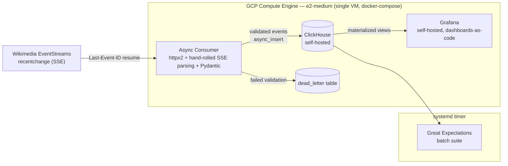

# WikiPulse — Streaming Analytics Platform: Vision & Architecture Decision Record

**Status:** Locked — v2 (refactored after critical review)
**Working name:** WikiStream
**Portfolio slot:** Data Engineering CV, project 3 of 3 (after W3C ETL, LAAD)
**Related documents:** CV Bolstering Plans (research notes), current DE/AI-ML/SWE CVs

### Revision note (v1 → v2)
This version followed an external critical review (two independent critiques) plus a fresh re-read against the original brief. Changes: cut the Snowflake cold-path tier entirely (kept as a documented rejected alternative, not built); added a Trade-off table, Constraints, Architecture Principles, and a Scalability & Future Evolution note; de-numbered the testing coverage composition (kept the 100%/90% bar, dropped the flaky test-count estimate); fixed a Terraform state-bootstrap ordering bug, a GitHub Environments feasibility gap, and a mid-run (not just pre-teardown) data-loss gap that the first draft missed; and verified the entire technology stack against current (July 2026) releases for mutual compatibility.

### Revision note (v2 → v3)
Closed two gaps that were never actually decided either way (not a reopening of locked decisions): infrastructure-level VM health monitoring, and where the consumer's built container image lives. Added Cloud Monitoring (ADR-010) and Google Artifact Registry (ADR-007/ADR-008) on that basis. A third option — replacing the systemd timers with Cloud Scheduler + Cloud Run Jobs — was seriously considered and explicitly rejected; logged in the Trade-off table (§5) and Deferred gaps (§9) rather than silently dropped.

---

## 1. Vision

### 1.1 Gap being filled
The DE CV currently proves two things well — event-driven ingestion at the source level (LAAD: Kafka KRaft, AWS) and batch lakehouse engineering (W3C ETL: Databricks DLT, Azure). It does not yet prove **real-time OLAP-native analytics** or **continuous-stream ingestion** (persistent connection, backpressure, windowed aggregation) as opposed to batch-scheduled or broker-mediated pipelines. It also carries no evidence of GCP. Wikimedia EventStreams provides a continuously available, public, high-volume event stream ideal for demonstrating streaming analytics without synthetic workloads or private APIs.

### 1.2 Elevator pitch
A continuous Server-Sent-Events consumer ingests every Wikipedia edit in real time, validates and batches it into a self-hosted ClickHouse instance whose materialized views drive a live Grafana dashboard. The signal isn't "used ClickHouse and Grafana" — it's a resilient, benchmarked, single-purpose real-time analytics platform, backed by real throughput and latency numbers captured from a live run, not synthetic test data.

### 1.3 Architecture Principles
The lens every ambiguous decision in the Master Plan should pass through:
- **Infrastructure as Code, including the boring parts** — the one-off state-bucket bootstrap included, not just the interesting resources.
- **Reproducible over persistent** — a disposable stack that rebuilds identically beats an always-on service, given this project's constraints.
- **Vertical scaling by design, not by oversight** — see §6.
- **Every tool earns its place** — no technology included because it's a recognisable keyword. (This is the direct lesson from cutting Snowflake — see §5 and ADR-003.)
- **Observable and secured to an actual threat model** — sized to what a personal demo VM needs, not a template checklist.
- **Cost understood before it's spent** — every component's cost profile is known before it's provisioned.
- **The bar that matters most gets 100%; everything else gets a high, honest bar** — not one blended number.

### 1.4 Constraints
- Single developer, building with agentic coding assistance.
- Recruiter-facing portfolio artifact — optimised for interview legibility, not for running as a real product.
- Must be fully reproducible from a clean environment via Terraform + versioned migrations.
- Cost ceiling: GCP's $300/90-day trial credit; no ongoing spend expected after teardown.
- Must not duplicate tooling already proven elsewhere in the portfolio (Kafka, Airflow, Prometheus all excluded on this basis).
- Must remain intelligible as evidence (README, diagrams, screenshots) after the infra is torn down and possibly after graduation, with no live system required to assess it.

### 1.5 Non-goals
- Not a Kafka project — already proven on LAAD; this project proves high-throughput ingestion *without* a broker.
- Not an always-on production service — see ADR-001.
- Not an ML/anomaly-detection project — see ADR-011.
- Not a second Airflow/Prometheus showcase — both already proven on W3C ETL.
- Not a data warehouse project — Snowflake was considered and cut; see §5.

### 1.6 Definition of Done
- Consumer runs continuously for the full accumulation window with zero unhandled crashes (crash-and-recover via healthcheck/restart is fine and is itself evidence).
- All hero metrics (§7) captured with real numbers, not placeholders.
- Dashboard screenshots + a short recorded walkthrough captured before teardown.
- ClickHouse latency benchmark and consumer burst test both run and documented.
- Test suite green at the coverage bar in ADR-009.
- Infra torn down cleanly via `terraform destroy` (excluding the bootstrap state bucket); rebuild path documented and, ideally, re-tested once.
- README complete: architecture diagram, cost note, CV-ready bullet drafts.

---

## 2. System Architecture Overview

### Component inventory (verified current versions, July 2026)

| Layer | Technology | Verified version | Notes |
|---|---|---|---|
| Language | Python | 3.13 | Capped below 3.14 — Great Expectations declares `Requires: Python <3.14` |
| Async HTTP/SSE | `httpx2` | current (released Jul 14, 2026) | Pydantic-stewarded continuation of `httpx` — see compatibility notes below |
| SSE parsing | hand-rolled, in-repo | — | ~30-line parser over `httpx2`'s async streaming response; avoids depending on a wrapper library built on the now-stalled original `httpx` |
| Inline validation | Pydantic | v2.13.x | Same governance org as `httpx2` (Pydantic Services Inc.) |
| Batch data quality | Great Expectations (GX Core) | 1.18.1 | Installed with the `[clickhouse]` extra, which ships GX's own ClickHouse SQLAlchemy support |
| Hot store | ClickHouse | server 26.3 LTS, self-hosted (Docker) | — |
| ClickHouse client | `clickhouse-connect` | ≥1.6.0 | Official ClickHouse Inc. client; async-native since Mar 2026 |
| Dashboard | Grafana | 13.1.1 | — |
| ClickHouse↔Grafana bridge | `grafana-clickhouse-datasource` plugin | 4.18.0 | Requires Grafana v9+; provisionable as code |
| Alerting (application-level) | Grafana native alerting | — | No Prometheus |
| Alerting (infrastructure-level) | GCP Cloud Monitoring + Ops Agent | — | Distinct layer from Grafana's application/pipeline alerting — see ADR-010 |
| Scheduling | systemd timer | — | GX suite job |
| Compute | GCP Compute Engine `e2-medium` | — | Single VM, docker-compose |
| Container registry | Google Artifact Registry | — | Hosts the consumer's built image — see ADR-007/ADR-008 |
| IaC | Terraform | ~1.15.x | BUSL-licensed since 2023 — already accepted across every other portfolio project |
| IaC provider | `google` (Terraform) | 7.41.0 | — |
| State backend | GCS bucket | — | Bootstrapped separately — see ADR-007 |
| Secrets | GCP Secret Manager | — | Zero static credentials |
| CI/CD | GitHub Actions + Workload Identity Federation | — | Auto plan, manually-gated apply |
| Testing | pytest + pytest-cov | latest stable | No specific pin needed |
| Security | VPC firewall, IP-restricted | — | No domain, no TLS |
| Networking | Static external IP | — | — |

### Compatibility notes (verified July 2026 — re-check at actual build time)
- **Python is pinned to 3.13, not 3.14**, specifically because Great Expectations caps at `<3.14`. `clickhouse-connect` and Pydantic already support 3.14, so GX is the binding constraint — pin the whole project to 3.13.
- **`httpx` (the library `httpx-sse` depends on) is in a stalled maintenance state**: its primary maintainer closed community issues/discussions in Feb 2026 with no stable release since Dec 2024. Pydantic Services Inc. has since taken over stewardship under the name `httpx2` (Production/Stable, actively released). This project uses `httpx2` directly for the async streaming client — not `httpx-sse`, whose own compatibility with `httpx2` is unconfirmed. ADR-004 should be read as targeting `httpx2`'s native async streaming API with a small hand-written SSE parser, not a wrapper package.
- **Great Expectations' GitHub org changed** to `fivetran/great_expectations` following a 2026 stewardship transfer — worth knowing when searching for it; not a reason to avoid it, it's still releasing monthly.
- **Terraform is BUSL-licensed** (source-available, not OSI-approved) since 2023 — no change from what's already accepted on every other portfolio project.
- **Cloud Monitoring's out-of-the-box VM metrics are partial**: CPU utilisation, network traffic, and uptime are collected agentless; memory and disk usage are not — those require the Ops Agent installed on the VM. Since disk is the metric that actually matters here (§8), the Ops Agent is a required install, not optional polish.
- Re-verify every version above at actual Master Plan/implementation time — this reflects what was current while writing this document, not a permanent pin.

---

## 3. Architecture Decision Records

### ADR-001: Deployment Lifetime & Teardown Model
**Decision:** Time-boxed demo, not persistent. Build once, run continuously for an accumulation window (24–48h minimum, longer if it improves trend data), capture all evidence, then `terraform destroy`. Fully rebuildable from Terraform + versioned ClickHouse DDL migrations.
**Rationale:** GCP's welcome credit is $300/90 days — this doesn't cleanly fund always-on hosting across a 3-month application window. Matches the existing portfolio pattern (W3C ETL's Azure deployment was also torn down). "Rebuilds identically on demand" is itself a legitimate reproducibility bullet.
**Consequences:** No persistent link for interviewers — mitigated with a recorded walkthrough + screenshots. A VM failure mid-window costs the run unless backups happen *during* the window, not just before teardown (fixed in ADR-006). The bucket holding Terraform's own state cannot be inside the config it's tracking, or `destroy` deletes its own state file mid-operation — it's bootstrapped separately (ADR-007).

### ADR-002: Compute Topology & Service Hosting
**Decision:** Single Compute Engine VM (`e2-medium`) running the whole hot path via docker-compose: consumer, ClickHouse, Grafana as three services on one instance.
**Rationale:** Self-hosting both ClickHouse and Grafana on one VM is a legitimate, common pattern at this scale. Splitting across VMs adds ops surface with no signal gain here.
**Consequences:** Single point of failure — acceptable given ADR-001. Resize if the burst test (§7) shows memory pressure.

### ADR-003: Primary Analytical Store — ClickHouse, Self-Hosted
**Decision:** ClickHouse is the engine; it is self-hosted via the official Docker image, not ClickHouse Cloud.
**Problem:** Hot-path analytical serving needs an engine built for real-time OLAP at high insert rates with sub-second aggregation queries, hosted at zero recurring cost past a short trial window.
**Alternatives considered and rejected:** see the trade-off table (§5) for the full comparison against PostgreSQL/TimescaleDB, BigQuery, Elasticsearch, Druid/Pinot, and Snowflake. In short: none combine genuine real-time OLAP performance with a self-hostable, zero-license-cost deployment at this scale.
**Rationale for self-hosting specifically:** ClickHouse Cloud has no permanent free tier (30-day trial only), so self-hosting is the only route to genuinely zero-marginal-cost hosting past a trial window. It's Apache 2.0, and single-server deployment is a documented, common pattern even at small scale. `clickhouse-connect`'s async-native client (shipped March 2026) avoids blocking the consumer's event loop, which the older thread-pool-wrapped approach didn't cleanly solve.
**Consequences:** Ahmed owns ops (backups, upgrades) — mitigated by the in-window backup cadence and pre-teardown backup (ADR-006) and by the whole stack being disposable/rebuildable.

### ADR-004: Ingestion Consumer Design
**Decision:** Async Python consumer using `httpx2`'s native async streaming client against the `recentchange` stream, with a small hand-written SSE parser, resuming via `Last-Event-ID` on reconnect. Events are validated inline against a Pydantic model; valid events are batched and flushed to ClickHouse on whichever trigger fires first — a size threshold or a flush-interval timer (values set from observed baseline once connected, not guessed upfront). Runs via Docker `restart: unless-stopped`, brought up on boot by a systemd-managed compose stack, with a Docker healthcheck per service so a wedged-but-alive container is caught, not just a crashed one.
**Rationale:** Async I/O lets batching/flush logic run concurrently with the persistent stream read without blocking it — the detail that actually demonstrates engineering for a high-throughput continuous source, not a for-loop in a script. `httpx2` over `httpx-sse` specifically because the latter depends on the now-stalled original `httpx` (see compatibility notes, §2); a hand-written parser over `httpx2`'s own streaming API removes that dependency risk entirely rather than trading one uncertain wrapper for another. Healthchecks catch the harder failure mode a bare restart policy misses.
**Consequences:** Batch-size/interval values are a tuning exercise once real throughput is visible — document the chosen values and why. The SSE parser is small enough (~30 lines) that owning it outright is less risk than depending on a third-party wrapper of uncertain status.

### ADR-005: Data Quality Architecture
**Decision:** Split by what each tool is built for. Pydantic validates every event inline pre-insert (required fields, types, bot flag boolean, timestamp not stale/future) — cheap, sub-millisecond. Great Expectations runs as a periodic batch suite (systemd timer) against a rolling window already in ClickHouse — null rates, freshness lag, cardinality — connecting via SQLAlchemy through GX's own `[clickhouse]` extra (GX has had ClickHouse support since 2023). Failed-validation events route to a `dead_letter` table in ClickHouse, not a file.
**Rationale:** Forcing GE into a per-event path fights the tool; splitting per strength is a stronger interview answer. A queryable, dashboard-able dead-letter table is cheap extra signal (a DLQ-rate panel on Grafana), and it's also how schema drift in the source stream gets caught (§9).
**Consequences:** Two validation code paths — acceptable since they check genuinely different things.

### ADR-006: ClickHouse Schema, Aggregation, Retention & Backup
**Decision:** Raw events in a partitioned MergeTree table. Rolling KPIs computed by materialized views into `AggregatingMergeTree`/`SummingMergeTree` targets, updated on insert. Schema defined via versioned, numbered `.sql` migration files applied in order by a small runner — consistent with the Alembic/dbt schema-versioning discipline already used elsewhere in the portfolio. Raw events carry a 30-day TTL; materialized aggregates are exempt. A native ClickHouse `BACKUP` runs to GCS on a periodic cadence **during** the run window (not only immediately before teardown), and at least one backup is restored and spot-checked before the run is considered complete.
**Rationale:** MVs are the actual "why ClickHouse" story — pushing aggregation cost to insert time is what makes the dashboard genuinely real-time. TTL and versioned migrations are near-zero-cost additions that read as deliberate design. An in-window backup cadence (not just pre-teardown) closes the gap where an unplanned VM failure mid-run would otherwise cost the whole accumulation window. A backup that's never restored is a hope, not a guarantee — restoring one is cheap insurance against finding that out at the worst time.
**Consequences:** MV logic needs its own correctness tests — a silently-wrong MV is worse than no MV.

### ADR-007: Infrastructure as Code & State Management
**Decision:** Terraform with the `google` provider — network / compute / iam / storage modules, matching the structure used on the AWS/Azure projects. The `storage` module also provisions a Google Artifact Registry repository, which hosts the consumer's built container image (previously undecided — see ADR-008). The GCS bucket used for remote state is provisioned by a small, separate bootstrap configuration with **local** state, applied once, manually, before the main config ever runs — it is never destroyed by the main config's `terraform destroy`.
**Rationale:** Keeps "everything is Terraform, nothing is click-ops" consistent. Artifact Registry was never actually decided against anything — some image registry was always going to be needed, and a GCP-native one keeps the toolchain consistent with the rest of the deployment at no incremental cost. The bootstrap split exists because a config cannot safely hold its own remote-state backend as a destroyable resource: destroying it would delete the state file tracking the destroy operation itself. This is a well-known Terraform bootstrapping pattern, not a workaround specific to this project.
**Consequences:** One small extra one-time step (apply the bootstrap config once, locally) that isn't part of the normal CI/CD flow — document this clearly so it isn't rediscovered the hard way during teardown.

### ADR-008: CI/CD Pipeline & Deployment Approval Gate
**Decision:** Two GitHub Actions workflows, both authenticating via Workload Identity Federation. `plan` runs `fmt`/`validate`/`plan` automatically on every PR and posts the plan as a comment. `apply` triggers on merge to main but targets a GitHub Environment with a required reviewer — the job pauses for manual approval in the Actions UI before running `terraform apply`. Separately, CI builds the consumer's container image and pushes it to the Artifact Registry repository provisioned in ADR-007; the VM's service account is granted `artifactregistry.reader`, scoped to that one repository — nothing broader.
**Rationale:** Automating plan but gating apply behind manual approval mirrors a real production release-gate pattern — different signal from DevSync's fully-automated rolling deploy, reflecting that this infra is provisioned deliberately and torn down, not continuously redeployed. The registry destination was never actually decided in v1/v2 — Artifact Registry over Docker Hub/GHCR keeps the whole toolchain GCP-native at zero incremental cost, and the scoped-reader grant keeps ADR-010's least-privilege posture consistent.
**Consequences:** GitHub Environment protection rules with required reviewers behave differently across public/private repos and account tiers — **verify this is available on the actual repo before the Master Plan assumes it.** Fallback if unavailable: a `workflow_dispatch`-triggered apply job, which preserves the "a human must consciously trigger it" property without needing the Environments feature.

### ADR-009: Testing Strategy & Coverage Targets
**Decision:** pytest + pytest-cov. Two CI coverage gates: **100%** on explicitly designated business-critical modules (consumer parsing/batching/validation, dead-letter routing, MV correctness assertions, GX suite configuration) and **~90%** line coverage overall. The exact test composition and count are a Master Plan concern, not fixed here — an upfront test-count estimate would be a guess dressed up as a target.
**Rationale:** A single blended coverage number hides whether the parts that actually matter are tested. Splitting the gate like DevSync's 85%/85%, but tightened to 100% on core logic, is a deliberately higher bar — consistent with the "maximise impressiveness" mandate. Naming the modules explicitly (rather than a vague "core logic") keeps the 100% figure defensible under interview questioning.
**Consequences:** The Master Plan must define the exact module boundary for "business-critical" early — phase one, not an afterthought — since the coverage gate is meaningless until that boundary is fixed.

### ADR-010: Observability, Alerting & Security
**Decision:** Two distinct, non-overlapping monitoring layers. *Application/pipeline health* is Grafana's built-in alerting (not Prometheus) covering consumer-down, dead-letter-rate-threshold, and ClickHouse-insert-failure conditions — Prometheus is deliberately not reused since it's already demonstrated on W3C ETL. *Infrastructure health* is GCP Cloud Monitoring, reading the VM's hypervisor-level metrics (CPU, network, uptime — agentless) plus memory and disk via the Ops Agent, with `google_monitoring_alert_policy` resources for disk-almost-full and VM-unreachable. Dashboards are defined as code (JSON provisioning files in-repo, using the `grafana-clickhouse-datasource` plugin's own provisioning support). Network exposure is minimal: GCP VPC firewall rules restrict Grafana's and ClickHouse's ports to Ahmed's IP only — no reverse proxy, no TLS, no custom domain. Secrets live in GCP Secret Manager, fetched at boot by the VM's service account, which is scoped to **least privilege** — IAM bindings limited to exactly the secrets and resources this project needs, nothing broader.
**Rationale:** Same "don't repeat a tool already on the CV" logic that dropped Kafka and Airflow applies to Prometheus. The infrastructure layer was never actually decided in v1/v2 — it's a genuine gap, not a duplicate of Grafana's job: Grafana can tell you the pipeline is unhealthy, but nothing previously told you *why* if the cause was the VM itself running out of disk from a multi-day continuous write workload (§8 risk). Cloud Monitoring closes that without touching the application-alerting decision at all. IP-restricted firewall is the simplest posture that's still a deliberate choice, appropriate for a personal demo VM. Secret Manager plus an explicitly least-privileged service account keeps "zero static credentials, minimal blast radius" consistent with every other project.
**Consequences:** Dashboard/ClickHouse are inaccessible from anywhere but Ahmed's current IP — fine for a personal demo, but showing it live to someone else needs either screen-sharing or a temporary firewall widen. The Ops Agent is one more thing installed on the VM, though it's a standard, GCP-maintained agent, not custom infrastructure.

### ADR-011: Scope Boundary — Pure DE, No ML Layer
**Decision:** No anomaly/vandalism-detection or other ML-flavoured feature on top of the pipeline, despite the edit-velocity data supporting it. Deferred, not built.
**Rationale:** This project exists to fill DE-specific gaps without overlapping LAAD, which already owns the ML/anomaly-detection story. Adding ML here blurs the separation-of-concerns argument that justified the domain choice.
**Consequences:** Logged as a known, deliberate gap.

---

## 4. Trade-off Table

| Decision | Alternatives considered | Why rejected |
|---|---|---|
| ClickHouse, self-hosted | PostgreSQL/TimescaleDB | Not built for OLAP at this insert/aggregation rate |
| | BigQuery | Fully managed, no self-hosted-ops story; streaming inserts are an add-on to a batch-first design, weakening the "real-time" positioning |
| | Elasticsearch | Built for search/logs, not columnar aggregation |
| | Druid / Pinot | Genuinely real-time OLAP, but operationally heavy (coordinator/ZooKeeper-style layers) for a single-VM demo |
| | Snowflake | Batch/warehouse-native engine; per-second billing with 60s minimum and auto-resume-on-query is close to the worst-case cost/latency profile for a continuously-refreshing live dashboard |
| | ClickHouse Cloud | No permanent free tier (30-day trial only) |
| Native SSE ingestion, no broker | Kafka in front of ClickHouse | Already proven on LAAD — redundant here, and the point of this project is proving ingestion works without one |
| Single VM, docker-compose | Kubernetes / GKE | Real signal, but on a different, larger project (LAAD's planned EKS migration) — duplicating it here dilutes both and is disproportionate to a disposable demo |
| Grafana-native alerting | Prometheus + Alertmanager | Already proven on W3C ETL — repeats ops surface without adding signal |
| Pydantic + GX split | GX-only | Fighting the tool by forcing per-event checks into a batch-oriented framework |
| | Pydantic-only | No statistical/distributional checks (null rates, freshness, cardinality) |
| Manual-gated Terraform apply | Fully automated apply-on-merge | This infra is provisioned deliberately and torn down, not continuously redeployed — automation here adds risk without matching benefit |
| Cold-path historical tiering | Snowflake (considered, then cut) | Real CV signal for a genuinely desired skill, but disproportionate build/test/narrative surface for a gap this project doesn't otherwise need to close; kept the project's story singular. See ADR-003. |
| systemd timers for GX suite + backup | Cloud Scheduler + Cloud Run Jobs (considered, then cut) | Genuine GCP breadth (serverless jobs, Direct VPC Egress, another least-privilege service account) and architecturally clean — but Cloud Run's value is compute independent of any one server, and here the thing being validated/backed up (ClickHouse) lives permanently on the same VM the timer already runs on. If that VM is down there's nothing to back up anyway, so the move buys portfolio breadth, not real reliability. Judged not worth the added networking/IAM/container-build surface for that trade; kept simple. |

## 5. Scalability & Future Evolution
WikiPulse is intentionally engineered for **vertical scaling on a single node**, not horizontal/distributed scaling — appropriate for a disposable demo processing one well-bounded stream. If requirements genuinely grew, the natural evolution would be: a replicated ClickHouse cluster with distributed tables once single-node throughput became the bottleneck; Kafka in front of the consumer if multiple, uncoordinated ingestion sources needed merging (the scenario LAAD already covers); horizontal consumer replicas behind a partitioned topic if the async consumer itself became the bottleneck; and multi-region ClickHouse replicas if the dashboard needed to serve geographically distributed users. None of this is built — it's stated here so the scoping reads as a decision, not an oversight.

## 6. Differentiation Layer & Hero Metrics

**Confirmed additions beyond the original spec:**
1. **ClickHouse latency benchmark** — raw-table scan vs. MV-precomputed query, same accumulated dataset, p50/p99 + rows scanned. Documented post-run.
2. **Consumer burst/backpressure test** — a custom Python asyncio load harness (deliberately not k6, which already covers HTTP load-testing on DevSync) fires synthetic events at multiples of observed baseline rate; asserts zero drops and correct dead-letter routing under burst.
3. **Cost/FinOps note** — a short documented breakdown: GCP VM spend vs. the $300 credit, and a projected "if this ran 24/7 for a month" estimate.

**Hero metrics (numeric thresholds baseline-derived once connected):**
- Sustained events/sec over the full run window
- Total events ingested, 0 dropped/duplicated
- Dead-letter rate (%)
- MV query p95/p99 latency vs. raw-scan p95/p99 (the new benchmark)
- Consumer uptime % / reconnects handled
- Peak burst rate sustained with zero drops (from the burst test)
- Largest observed editing burst handled
- Top edited pages detected correctly

## 7. Risks & Assumptions

**Assumptions** (each is a risk if it turns out false):
- Wikimedia's public stream stays available, free, and unauthenticated for the duration of the build/run.
- Observed event rate fits comfortably on a single `e2-medium` (re-benchmark and resize per ADR-002 if not).
- `clickhouse-connect`'s async client performs as documented against ClickHouse 26.3 LTS.
- The GitHub Environments/required-reviewer feature is available on the actual repo and account tier used.

| Risk | Mitigation |
|---|---|
| Wikimedia stream disruption during the run window | Reconnect/resume logic; build in slack, don't run right up against a deadline |
| GCP trial credit exhausted mid-build | Teardown discipline (ADR-001); modest VM sizing |
| Single-node ClickHouse VM failure — planned teardown | Native backup to GCS before teardown; restore-and-verify tested at least once |
| Single-node ClickHouse VM failure — unplanned, mid-run | In-window backup cadence (ADR-006), not just pre-teardown; bounded, understood data-loss window between backups |
| GX-via-SQLAlchemy-against-ClickHouse hits friction in practice | Fallback to native ClickHouse SQL checks if the SQLAlchemy path proves brittle — resolve early in the Master Plan |
| Wikimedia changes the `recentchange` event schema mid-run | Pydantic dead-letters unexpected shapes rather than crashing; a schema change shows up as a dead-letter-rate spike, not a silent failure |
| GitHub Environment required-reviewer gate unavailable on the actual repo | Fallback: `workflow_dispatch`-triggered apply job (ADR-008) |
| Terraform remote-state bucket destroyed by its own destroy operation | Bootstrapped separately, outside the main destroy scope (ADR-007) |
| VM disk fills up mid-run (continuous ClickHouse writes + in-window backups over 24–48h+) | Cloud Monitoring disk-almost-full alert via the Ops Agent (ADR-010) — catches it before it silently kills the accumulation window |
| Coverage bar (100%/90%) adds real time despite the relaxed timeline | Accepted trade-off — the time constraint has been explicitly deprioritised for this project |

## 8. Deferred / Known Gaps (deliberate, not oversights)
- Prometheus/exporter-based monitoring — already proven on W3C ETL; Grafana-native alerting used instead
- Custom domain + TLS — IP-restricted firewall only
- Always-on/persistent hosting — time-boxed and rebuildable instead
- ML/anomaly-detection layer — deferred to keep DE and AI/ML CV lanes cleanly separated (ADR-011)
- Kafka as a broker in front of ClickHouse — native ingestion used instead
- Snowflake / warehouse-tier historical analytics — considered as a cold-path addition, cut to keep the project's story singular (§5)
- Cloud Scheduler + Cloud Run Jobs for the GX suite/backup — considered, cut in favour of the existing systemd timers; the operational case was weak given both jobs run against a ClickHouse instance that lives on the same VM the timer already runs on (§5)

## 9. Handoff to Master Plan
This document is complete input for the Master Plan. Suggested phase shape: bootstrap (state bucket, IAM, network) → consumer + hot path → dashboard + alerting → data quality → differentiation layer/benchmarks → evidence capture → teardown (with the restore-and-verify step before final teardown). Each phase should have its own verification gate. Fix the "business-critical modules" boundary (ADR-009) and confirm GitHub Environment availability (ADR-008) in phase one — both are prerequisites the rest of the plan depends on. Re-verify the technology versions in §2 at the start of implementation, since this document reflects what was current while it was written, not a permanent pin.
